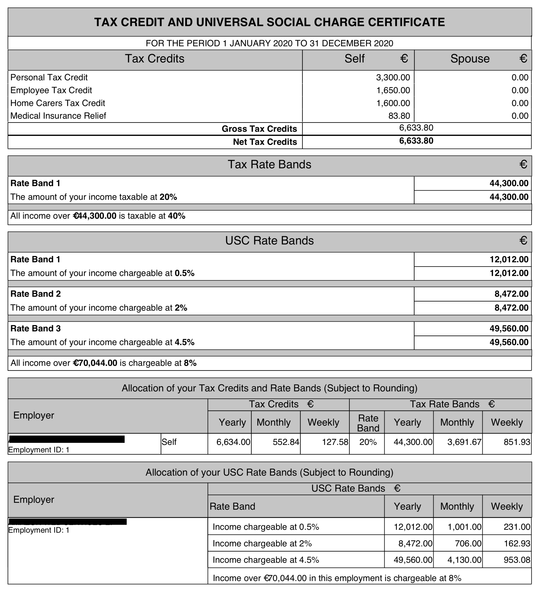
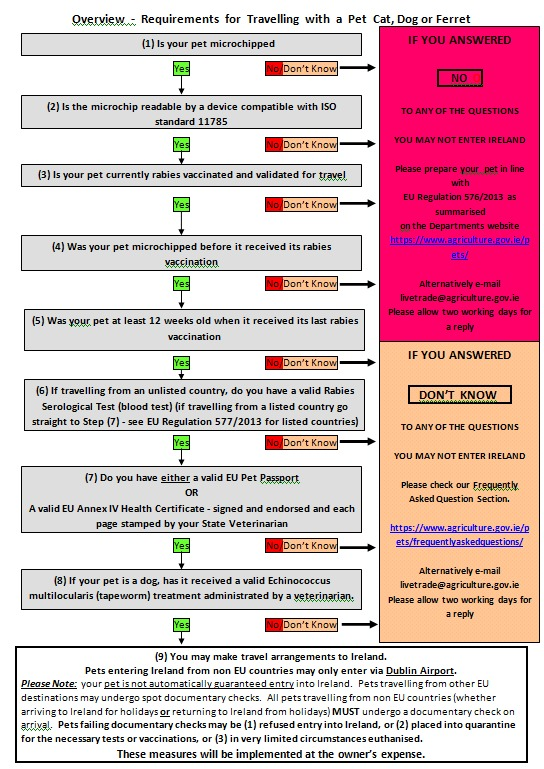

Chegando na Irlanda
========================================================================================================================

Por Adilson Ribeiro

Introdução
------------------------------------------------------------------------------------------------------

Este texto pretende auxiliar aqueles que estão vindo para a Irlanda a trabalho, com explicações básicas sobre diversos aspectos da mudança de país, como chegar, se instalar, burocracias obrigatórias e opcionais no país, etc.

Se você pretende levar pets para a Irlanda, o prazo é apertado e requer toda uma documentação específica, há um tópico dedicado à isso contribuído por Leandro Azeredo.

Uma versão curta e grossa desse FAQ seria:

1.  Entenda as semelhanças e as diferenças entre Brasil e Irlanda
2.  Verifique o que precisa ser feito ainda antes de sair do Brasil
3.  Verifique o que precisa ser feito logo após chegar na Irlanda
4.  Verifique o que pode ser feito com calma depois da chegada

Este texto é um "Work in Progress" - estará em construção permanentemente, já que regras mudam eventualmente e outros tópicos podem entrar ou sair.

Ressalvas:

*   Não trate nenhuma parte deste texto como verdade, sempre consulte fontes oficiais para ter a informação mais correta/atualizada;
*   Na medida do possível todas as seções terão links para sites oficiais tratando de cada assunto abordado;
*   Será tentado ser o mais preciso e correto quanto possível, no entanto erros ou imprecisões estarão presentes eventualmente;
*   Não use este conteúdo como conselho sobre imigração ou sobre práticas fiscais.

Caso tenha alguma sugestão ou crítica, envie e-mail para [chegandonairlanda@gmail.com](mailto:chegandonairlanda@gmail.com)

Caso queira conectar comigo no LinkedIn: [https://www.linkedin.com/in/adilsongvribeiro](https://www.linkedin.com/in/adilsongvribeiro)

Antes de Vir
----------------------------------------------------------------------------------------------------------

Antes de partir do Brasil para a Irlanda, diversas atividades são importantes para garantir chegada e estadia sem stress. Algumas delas dizem respeito à situação fiscal e legal no Brasil, enquanto outras dizem respeito à chegada e primeiros passos na Irlanda.

### Entender diferenças entre Brasil e Irlanda\[[editar](/w/index.php?title=Monolitico&action=edit&section=4 "Editar seção: Entender diferenças entre Brasil e Irlanda")\]

Há diversas diferenças entre os sistema legal, tributário, de saúde, de trânsito, etc.

É importante se inteirar dessas diferenças e os impactos que a mudança acarretará.

Especialmente, na Irlanda o sistema de aposentadorias é bastante diferente do Brasil e não há aproveitamento do tempo de contribuição à previdência pública brasileira na Irlanda.

Também haverá carência a partir do momento que começar a trabalhar para qualificar para auxílio doença, e licenças maternidade/paternidade.

De forma similar, não há acordos para evitar bi-tributação de renda, então caso ainda mantenha alguma fonte de renda no Brasil (cota de empresa, investimentos, imóveis alugados, etc) será tributado no Brasil e também poderá ser tributado na Irlanda.

  
[http://receita.economia.gov.br/interface/cidadao/irpf/2019/perguntao/perguntas-e-respostas-irpf-2019.pdf](http://receita.economia.gov.br/interface/cidadao/irpf/2019/perguntao/perguntas-e-respostas-irpf-2019.pdf) (pergunta 117, pagina 61)

[http://normas.receita.fazenda.gov.br/sijut2consulta/link.action?idAto=16002&visao=anotado](http://normas.receita.fazenda.gov.br/sijut2consulta/link.action?idAto=16002&visao=anotado)

[http://normas.receita.fazenda.gov.br/sijut2consulta/link.action?visao=anotado&idAto=77307#1661237](http://normas.receita.fazenda.gov.br/sijut2consulta/link.action?visao=anotado&idAto=77307#1661237)

### Procurações no Brasil

É muito importante deixar no Brasil procurações públicas de propósito geral ou específico, para que alguém de sua confiança possa resolver coisas na sua ausência, desde negociar imóveis ou veículos, até ir aos bancos onde tem conta para fechar conta ou modificar parâmetros.

Os bancos e os DETRAN, de forma geral, exigem procurações específicas para uma finalidade, especificando a atividade ou a conta corrente para a qual a procuração surtirá efeito.

Estas procurações são usualmente feitas em Cartório, onde o procurador deve ser identificado. Caso seja casado, é importante fazer para si e para seu cônjuge.

### Certificado Digital

Da mesma forma que as procurações, é interessante dispor de um certificado digital (e-CPF) em seu nome (e outro em nome de seu cônjuge, caso seja casado), pois diversos tipos de procedimento podem ser assinados digitalmente usando um certificado digital.

Certificados A1 valem por 1 ano e são eletrônicos (arquivos PFX/PEM), enquanto certificados A3 valem por 3 anos e são armazenados em tokens criptográficos.

### Documentação para seguro-saúde na Irlanda

Na Irlanda há um aumento no custo de seguros-saúde de 2% por ano de idade a partir de 34 anos caso a pessoa não tenha seguro-saúde de forma contínua desde maio de 2015. Para fugir desse custo extra, deve ser demonstrado que a pessoa não morava na Irlanda em Maio de 2015.

Isso pode ser comprovado com contracheques ou comprovantes de residência dessa época.

O nome dessa majoração é LCR - Lifetime Community Rating, mais informações podem ser encontradas no link abaixo:

[https://www.hia.ie/consumer-information/lifetime-community-rating-explained](https://www.hia.ie/consumer-information/lifetime-community-rating-explained)

Especialmente importante é a questão 13 no link acima:

13\. I am immigrating to Ireland. Will I have to pay a Lifetime Community Rating Loading?

\- If you purchase private health insurance within 9 months of becoming resident in Ireland you will not have to pay a Lifetime Community Rating loading on your premium. If you are 35 or older and you do not purchase private health insurance within 9 months of moving to Ireland, a loading of 2% of the gross premium for every year over the age of 34 that you have attained will be applied to your premium.

### Prontuário do Condutor/DETRAN

Caso tenha carteira de motorista no Brasil, e queira usar seu tempo de habilitação Brasileira no processo de obtenção de carteira de motorista na Irlanda, providencie o Prontuário do Condutor (ou nome similar) diretamente com o DETRAN do seu estado, pois em alguns casos essa informação só é fornecida presencialmente e diretamente ao interessado, ou através de procuração pública de propósito específico, então o mais simples é obter esse documento antes de vir.

### Casamento

Caso esteja noivo(a), namorando ou em união estável, avalie casar ou converter a união estável em casamento, já que a Irlanda requer uma burocracia adicional para reconhecimento da união estável e autorização de residência para o cônjuge.

Caso tenha uma união estável e queira vir sem converter em casamento, há um procedimento específico para conseguir a autorização de residência, caso um dos parceiros seja detentor de Work Permit critical skills:

[http://www.inis.gov.ie/en/INIS/Pages/de-facto-partner-of-a-critical-skills-employment-permit-holder-or-of-a-non-eea-researcher-on-a-hosting-agreement](http://www.inis.gov.ie/en/INIS/Pages/de-facto-partner-of-a-critical-skills-employment-permit-holder-or-of-a-non-eea-researcher-on-a-hosting-agreement)

Há um documento com perguntas e respostas sobre o residência e autorização de trabalho para cônjuges/parceiros de detentores de CSEP em:

[http://www.inis.gov.ie/en/INIS/faq-spouse-partner-csep.pdf/Files/faq-spouse-partner-csep.pdf](http://www.inis.gov.ie/en/INIS/faq-spouse-partner-csep.pdf/Files/faq-spouse-partner-csep.pdf)

Para o caso de um dos parceiros ser detentor de Work permit do tipo General Employment, esse esquema não se aplica.

### Traduções Documentos Pessoais

Providencie traduções juramentadas de certidões de nascimento e casamento, caso necessário, pois serão utilizadas para o PPS e GNIB.

### Diplomas

Caso tenha intenção de fazer Graduação ou pós-graduação na Irlanda, poderão ser necessárias as traduções do Histórico e diploma de segundo grau ou Histórico e diploma de Graduação ou pós-graduações já concluídas.

Em alguns casos (aproveitamento de disciplinas, por exemplo), pode ser necessária também a tradução do conjunto de ementas das matérias cursadas.

### Agendamento IRP/GNIB

**Atencão: Por causa da pandemia do COVID-19, vários procedimentos foram alterados.**  
**Verificar no site do INIS como está sendo feito o procedimento de registro, pois estão sendo mudados com frequência.**

[http://www.inis.gov.ie/](http://www.inis.gov.ie/)

Caso você (e/ou seu cônjuge e/ou filhos maiores de 16 anos) não tenham cidadania de país membro da UE, é necessário o registro no GNIB.

O registro é feito por agendamento, feito através do site da Garda para residentes em Dublin. Há uma grande disputa pelos agendamentos, o que normalmente causa um bom stress em quem está vindo.

Os agendamentos são liberados diariamente às 10h30 GMT, para datas 45 dias à frente. Eventualmente às 14h30 GMT são liberadas vagas residuais, que podem ser para qualquer data, às vezes para o mesmo dia.

Há plugins para o Google Chrome que auxiliam na localização dos agendamentos e rápido preenchimento dos dados, aumentando as chances de sucesso.

Para residentes em outras cidades, o processo é ligeiramente diferente, mas igualmente importante. Sem o registro no GNIB, você estará potencialmente ilegal na Irlanda.

[https://burghquayregistrationoffice.inis.gov.ie/](https://burghquayregistrationoffice.inis.gov.ie/) [https://gnibirpvisa.ie/App](https://gnibirpvisa.ie/App)

### Conta no MyGovID

Diversos órgãos do governo Irlandês usam a conta MyGovID como método de login unificado. Acesse o site e crie uma conta MyGovID básica antes mesmo de vir para a Irlanda, para que já possa interagir com alguns setores do governo, como por exemplo para marcar o agendamento do PPS.

[https://www.mygovid.ie/en-IE/Account/Register](https://www.mygovid.ie/en-IE/Account/Register)

### Agendamento PPS

**Atenção: Devido à pandemia do COVID-19, o atendimento ao PPS está sendo feito online. Favor consultar o site do Welfare para ver a situação atual no momento da sua vinda:**

[https://services.mywelfare.ie/en/topics/appointments/ppsn-appointment/](https://services.mywelfare.ie/en/topics/appointments/ppsn-appointment/)

O PPS é equivalente ao CPF brasileiro ou o SSN americano ou o SIN/NIS canadense. Agende o atendimento para criação do PPS para você e todos os membros da família que chegarão contigo. Os agendamentos normalmente ficam disponíveis do dia atual até quinze dias à frente, com exceções em épocas festivas, onde o setor pode ter recesso. Quando tiver a data certa de chegada, tenta agendar pros dias logo em seguida, pois o PPS é a base do seu relacionamento com o governo em vários níveis.

[https://www.mywelfare.ie/Appointments/Book?refresh=true](https://www.mywelfare.ie/Appointments/Book?refresh=true)

### Abertura de Conta em euros

É importante, também, ter uma conta em Euros para já ter recursos em moeda local quando chegar, e para evitar vir com papel moeda, que precisa ser declarado a partir de certo limite na saída do Brasil (acima do equivalente a R$ 10 mil) e entrada na Europa (acima do equivalente em 10 mil euros) ou cartões de crédito ou pré-pagos que pagam IOF de 6.38% e uma taxa de câmbio normalmente desfavorável.

Entre as opções, estão tentar abrir uma Conta no Banco alemão Online/Digital N26, ou abrir uma conta borderless Transferwise. Ambas não estão disponíveis para o público brasileiro, mas de forma geral podem ser abertas se você já tiver algum endereço na Europa para usar para a abertura da conta e recebimento do cartão de débito.

Há ainda a possibilidade de tentar abrir a conta direto num banco convencional na Irlanda, mas os bancos são bem criteriosos para com a abertura de conta. Há quem consiga, especialmente com o Bank of Ireland, que tem um serviço para abertura de contas para quem está indo.

[https://n26.com/r/adilsonv5710](https://n26.com/r/adilsonv5710)  

[https://transferwise.com/u/adilsonv3](https://transferwise.com/u/adilsonv3)  

[https://personalbanking.bankofireland.com/bank/coming-to-ireland/](https://personalbanking.bankofireland.com/bank/coming-to-ireland/)  

  

### Autorização de viagem de menor ao exterior

Caso esteja vindo com filho(s), mas sem um dos genitores, é necessário que o genitor ausente autorize expressamente o menor a sair do país e fixar residência na Irlanda.  

O CNJ redigiu a Resolução 131/2011 que lida com autorização de viagem de menores ao exterior desacompanhados de pelo menos um dos pais.  

A autorização deve ser redigida em português para ser apresentado à Polícia Federal no momento do embarque do menor no primeiro vôo doméstico, e deve ter uma versão traduzida para o Inglês para ser apresentada ao agente de imigração na chegada à Irlanda.  

É importante que a versão em inglês deixe explícito que o menor vai residir na Irlanda, não sendo apenas uma viagem de turismo.

Caso o vôo seja composto de múltiplos bilhetes para cada trecho, verificações adicionais podem ser necessárias nos países/aeroporto intermediários onde for feito desembarque/re-embarque e/ou controle migratório ao invés de simples conexão/escala. Consulte os procedimentos dos países onde for passar para se certificar se autorizações adicionais são necessárias.

[http://www.cnj.jus.br/programas-e-acoes/viagem-ao-exterior](http://www.cnj.jus.br/programas-e-acoes/viagem-ao-exterior)  

[http://www.inis.gov.ie/en/inis/pages/travel-with-children](http://www.inis.gov.ie/en/inis/pages/travel-with-children)

### Providenciando acomodação temporária/permanente

A parte mais complicada de Dublin é achar onde ficar e morar - **Tudo é caro**.  

Tente negociar pelo menos 15 dias de AirBNB ou hotel, pois usualmente é o tempo para conseguir um local permanente para ficar.  

Quanto mais barato for seu orçamento para o aluguel, maior a competição, é mais difícil conseguir.  

Há histórias de horror em Dublin acerca de acomodação, então já comece a se preocupar a partir do momento em que decidiu vir.  

Há serviços de "intermediação" da busca por um local para alugar, onde alguém aqui na Irlanda vai achar um imóvel de acordo com as suas necessidades/especificações, claro, cobrando algum valor por isso.  

Os sites mais utilizados para busca de imóveis (aluguel/compra/compartilhamento) são [www.daft.ie](http://www.daft.ie) e [www.myhome.ie](http://www.myhome.ie)  

Há uma dificuldade extra caso venha com animais de estimação, pois muitos _landlords_ rejeitam interessados com pets.  

Há também relatos de rejeição à casais com crianças pequenas - supostamente por uma dificuldade maior de despejar casais com filhos.

### Comprando a passagem aérea

Quanto maior a antecedência da compra, usualmente melhores os preços.

Dublin é um destino caro, especialmente vindo do Brasil, já que não há vôos diretos.

A época do verão Europeu, de junho a setembro, também tem preços bem mais caros.

Desde Abril/2019 a TAP iniciou voos diários entre Lisboa e Dublin, o que facilita a viagem, já que ela tem diversos voos das principais capitais para Lisboa, e a conexão na Europa continental seria numa cidade onde se fala português, o que pode ser mais confortável.

A TAP tem voos partindo - entre outras cidades - de Fortaleza, Natal, Recife, Salvador, São Paulo e Rio de Janeiro para Lisboa, com alguns voos fazendo escala em Lisboa e/ou Porto.

Também em algumas cidades estão disponíveis voos das seguintes companhias:

*   AirEuropa, com conexão em Madri;
*   Condor, com conexão em Frankfurt;
*   AirFrance/Joon, com conexão em Paris;
*   KLM, com conexão em Amsterdã
*   British Airwayscom conexão em Londres;
*   Transportes Aéreos Cabo Verde, com conexões em Cabo verde e destinos para diversas cidades da Europa.

entre outras companhia não citadas.

A Gol tem voos para Dublin em parceria com a Delta Airlines, fazendo Brasil(Rio ou São Paulo)-EUA(Atlanta ou NYC)-Irlanda(Dublin), mas atente para a necessidade de visto americano de turismo ou trânsito nesse caso.

Uma possível opção é comprar o trecho Brasil-Europa numa das companhia acima, e comprar um bilhete separado desta cidade para Dublin, o que usualmente barateia bastante e dá a oportunidade de passar alguns dias neste destino intermediário.

No entanto, convém lembrar que nesse caso você passará por 2 processos migratório, na cidade intermediária e em Dublin.

Caso seja um bilhete único Brasil-Dublin, a conexão no ponto intermediário usualmente não têm imigração, com exceção de Londres, usualmente.

Também convém lembrar ao comprar dois bilhetes separados de deixar uma boa sobra de tempo para a conexão, pois nesse caso você será o responsável em caso de perda de conexão por causa de atrasos no vôo chegando do Brasil.

### Organizar traslado de animais de estimação

Caso tenha animais domésticos que pretende trazer para a Irlanda, comece o mais cedo possível a se inteirar sobre o assunto.

Há bastante burocracia e prazos bem largos para diversas partes do processo.

Os procedimentos para a Europa de forma geral incluem vacinação, quarentena, exame de sorotipagem para raiva, implantação de chips, etc.

Os procedimentos durante a viagem também tem de ser verificados com as companhia aéreas e para cada local onde seja feita conexão. Verifique também que dia da semana chegará na Irlanda, pois caso chegue em fins de semana os animais poderão ficar recolhidos num canil para inspeção antes de serem liberados.

Convém lembrar que ter animais de estimação usualmente dificulta fechar o aluguel de um imóvel, pois os landlords não costumam ser simpáticos aos inquilinos com pets.

Um relato longo e mais completo do procedimento para trazer animais de estimação pode ser encontrado no tópico [Trazendo Animais de Estimação](#Trazendo-Animais-de-Estimação)

### Seguro Viagem

Antes de vir para a Irlanda é importante se certificar que terá cobertura médica/hospitalar pública ou privada.

Caso não tenha, ou leve algum tempo até iniciar a cobertura, é importante contratar um seguro viagem, já que o atendimento particular é caro.

[https://www.citizensinformation.ie/en/health/health\_system/entitlement\_to\_public\_health\_services.html](https://www.citizensinformation.ie/en/health/health_system/entitlement_to_public_health_services.html)

### Fuso horário

A Irlanda usa GMT+1 como fuso horário padrão, denominado IST - Irish Standard Time. Durante o inverno os relógios são atrasados uma hora para GMT.

A mudança de horário ocorre no último domingo de outubro (uma hora a menos) e no último domingo de março (uma hora a mais).

A depender da época do ano e da região do Brasil, podemos ter de duas a seis horas de diferença.

[https://en.m.wikipedia.org/wiki/Time\_in\_the\_Republic\_of\_Ireland](https://en.m.wikipedia.org/wiki/Time_in_the_Republic_of_Ireland)

[https://en.m.wikipedia.org/wiki/Time\_in\_Brazil](https://en.m.wikipedia.org/wiki/Time_in_Brazil)

### Feriados na Irlanda

A Irlanda tem 9 feriados definidos. Os feriados usualmente caem nas segundas feiras.

*   Ano Novo (1 de Janeiro)
*   Dia de São Patrício (17 de Março)
*   Segunda de Páscoa
*   Primeira segunda-feira de Maio, Junho e Agosto
*   Última segunda de Outubro
*   Natal (25 de Dezembro)
*   Dia de Santo Estêvão (26 de dezembro)

Apesar da Irlanda ser um país de maioria católica, a Sexta-feira santa/da Paixão não é feriado. O feriado é comemorado na segunda-feira seguinte. Muitas empresas e a maioria das escolas tem recesso tanto na sexta quanto na segunda.

[https://www.citizensinformation.ie/en/employment/employment\_rights\_and\_conditions/leave\_and\_holidays/public\_holidays\_in\_ireland.html](https://www.citizensinformation.ie/en/employment/employment_rights_and_conditions/leave_and_holidays/public_holidays_in_ireland.html)

[https://www.workplacerelations.ie/en/what\_you\_should\_know/public-holidays/](https://www.workplacerelations.ie/en/what_you_should_know/public-holidays/)

[https://www.workplacerelations.ie/en/publications\_forms/owt\_guide\_holidays\_public\_holidays.pdf](https://www.workplacerelations.ie/en/publications_forms/owt_guide_holidays_public_holidays.pdf)

### Direito à Férias

Na Irlanda as férias normalmente são contadas em dias úteis. A legislação prevê um mínimo de 20 dias de férias. O contrato de trabalho pode dar direito a uma quantidade superior de dias de férias.

[https://www.citizensinformation.ie/en/employment/employment\_rights\_and\_conditions/leave\_and\_holidays/annual\_leave\_public\_holidays.html](https://www.citizensinformation.ie/en/employment/employment_rights_and_conditions/leave_and_holidays/annual_leave_public_holidays.html)

[https://www.workplacerelations.ie/en/publications\_forms/owt\_guide\_holidays\_public\_holidays.pdf](https://www.workplacerelations.ie/en/publications_forms/owt_guide_holidays_public_holidays.pdf)

### Mantende numero de telefone do Brasil

Pode valer a pena trazer o chip brasileiro para uso aqui, convertendo o numero para pre-pago se necessário.

Diferentes operadoras do Brasil tem diferentes politicas em relação prepago e roaming international.

O chip basileiro pode ser util para autenticaçao de dois fatores de serviços em uso no Brasil.

Chegando na Irlanda
-------------------------------------------------------------------------------------------------------------------------

### Passando pela Imigração

De forma geral, a imigração é tranquila, bastando estar portando os seguintes documentos:

*   Passaporte(s);
*   Se necessário, visto(s) de entrada na Irlanda;
*   Work Permit;
*   Comprovante de acomodação para os primeiros dias;
*   Comprovante de seguro viagem para os primeiros dias;
*   Certidões de casamento e nascimento para comprovação de vínculo familiar;
*   Autorização de viagem/residência no exterior caso algum familiar menor de 18 anos esteja desacompanhado do(s) genitor(es).

A depender do agente de imigração, ele pode não pedir os comprovantes de seguro e acomodação, mas é bom estar preparado para mostrar caso seja solicitado.

Durante o controle migratório será feito um pré-registro no GNIB (Garda National Identification Bureau) de todos os portadores de passaportes não-europeus com idade igual ou superior a 16 anos. Uma data limite para registro no GNIB será também estabelecida (usualmente 90 dias após da data de entrada), sendo necessário realizar o primeiro registro no GNIB e obter a autorização de residência, com o Stamp correspondente ao tipo de autorização.

### Adquirindo chip com número local

Ao sair do desembarque, se tiver agendado o PPS para os próximos dias, uma possibilidade é comprar logo um chip de operadora local em alguma loja de conveniência do aeroporto. Há lojas de conveniência no aeroporto onde o chip poderá ser adquirido. A Irlanda dispõe de portabilidade numérica, então você poderá depois migrar o número caso troque de operadora.

O plano de numeração telefônico na Irlanda usa prefixos geográficos para telefones fixos e não-geográficos para telefones móveis.

Para discar para outro número Irlandês, a discagem poderá ser no formato 0+Código de Área ou Operadora Celular + Terminal ou alternativamente, pode-se discar o número em formato internacional +353-Código de área ou operadora móvel+terminal ou 00+353+Área/Operadora+Terminal.

Os códigos para operadoras móveis começa com 8 (81 a 89), então qualquer número 08X-NNN-NNNN (+353-8X-NNN-NNN) indica um terminal móvel.

Os códigos geográficos começam de 1 a 7 e 9. Eles têm comprimento variável. A lista e um mapa com a distribuição geográfica dos prefixos podem ser encontrados em:

[https://www.comreg.ie/industry/licensing/numbering/area-code-maps-2/#modal-text](https://www.comreg.ie/industry/licensing/numbering/area-code-maps-2/#modal-text)

### Adquirindo cartões de transporte público

**Atenção: por conta da Pandemia de COVID-19, há regras para uso de transporte público. Favor verificar em:**

[https://www.nationaltransport.ie/news/covid-19-service-information-update/](https://www.nationaltransport.ie/news/covid-19-service-information-update/)

Também nas loja de conveniência no aeroporto, você poderá comprar cartões de transporte público (Leap Card).

Há cartões específicos para turista (para 1, 3 e 7 dias, não recarregáveis) que tem uso ilimitado para Ônibus, DART, LUAS, e também cartões convencionais recarregáveis que podem ser usados nos três modais.

Há cartões para adultos e crianças (de 5 a 15 anos). Crianças até 4 anos não pagam passagem. Para idades entre 16 e 18 há cartões Leap específicos que podem apenas ser comprados on-line .

Você pode criar uma conta no site do Leap Card para registrar seus cartões e acompanhar o seu uso, assim como também pode configurar auto top-up dos cartões, com crédito automático de 30 euros quando o saldo fica abaixo de 10 euros.

Há também um app para celulares com suporte a NFC para ver instantaneamente informações de um leap card ou recarregar o cartão.

[https://about.leapcard.ie/leap-visitor-card](https://about.leapcard.ie/leap-visitor-card)  
[https://about.leapcard.ie/about/card-ticket-types](https://about.leapcard.ie/about/card-ticket-types)  
[https://about.leapcard.ie/about/card-ticket-types/child-leap-card](https://about.leapcard.ie/about/card-ticket-types/child-leap-card)  
[https://www.leapcard.ie/en/login.aspx](https://www.leapcard.ie/en/login.aspx)  
[https://about.leapcard.ie/leap-top-up-app](https://about.leapcard.ie/leap-top-up-app)  

### Transfer aeroporto/cidade

Basicamente há 4 formas de sair do aeroporto e ir para Dublin.

*   Carona de amigos/familiares;
*   Taxi;
*   Serviços de Transfer;
*   Ônibus;

Há dois terminais de ônibus no aeroporto, para ônibus intermunicipais e para transfer para diversos pontos de Dublin.

Deslocamento/Transporte em Dublin
-----------------------------------------------------------------------------------------------------------------------------------------------------

### Caminhada

A não ser que você já chegue em Dublin com um carro, provavelmente vai caminhar bastante. Dublin é uma cidade relativamente pequena, e muita coisa é acessível à pé, assim como o ponto de ônibus ou a estação mais próxima de Luas ou DART. A cidade também é basicamente plana, o que somado a baixa temperatura, permite caminhar sem se tornar uma poça ambulante de suor.

### Taxi / Uber

Em Dublin o UBER é executado pelos táxis convencionais, então não faz muito sentido usar. O app "Free Now" (MyTaxi anteriormente) é mais eficaz nesse aspecto, já que muitos táxis são cadastrados e o app pode cadastrar seu cartão para pagamento em débito em conta.

A cidade conta com uma boa quantidade de táxis e quando pedidos pelo app costumam chegar rapidamente.

### Bicicleta

Como a cidade é bem provida de ciclovias, e o trânsito é relativamente organizado, com motoristas usualmente cientes dos ciclistas, pedalar pode ser uma boa ideia para os deslocamentos diários. Bicicletas aqui são caras, com muitas lojas especializadas.

Acha-se muitos locais para deixar a bicicleta, porém sempre prenda bem a bicicleta, pois em alguns bairros em particular, podem furtar a bicicleta ou partes dela.

### Carro Próprio

Uma opção também é comprar um carro. Carros usados são muito acessíveis, apesar do seguro ser caro e obrigatório. Muitas seguradoras não oferecem seguro para portadores de carteira de motorista de outros países.

### Tax Saver Schemes

Para quem quiser comprar uma bicicleta ou usar transporte público, há a possibilidade de benefícios fiscais oferecidos pelo governo para compra de bicicleta ou para compra de passes mensais ou anuais de transporte público.

Nesses casos, a empresa onde você trabalha paga o valor da aquisição da bicicleta ou ticket mensal/anual, e você paga mensalmente com dedução no seu contracheque. O valor mensal pago é deduzido da sua renda bruta do mês, diminuindo o imposto (Income Tax) pago.

A depender do salário, o custo final da aquisição pode chegar a 48% do custo nominal da bicicleta ou bilhete de transporte público.

[https://www.citizensinformation.ie/en/money\_and\_tax/tax/income\_tax\_credits\_and\_reliefs/cycle\_to\_work\_scheme.html](https://www.citizensinformation.ie/en/money_and_tax/tax/income_tax_credits_and_reliefs/cycle_to_work_scheme.html) [https://www.citizensinformation.ie/en/travel\_and\_recreation/public\_transport/public\_transport\_commuter\_tickets\_and\_tax.html](https://www.citizensinformation.ie/en/travel_and_recreation/public_transport/public_transport_commuter_tickets_and_tax.html)

### Transporte Publico

#### Leap Card

Todas as opções de transporte publico podem ser pagas, via de regra, usando dinheiro, ou o cartão de passagem eletrônico chamado Leap Card, disponível em algumas cidades.

Com o leap card, usualmente o preço da tarifa é mais baixo comparado à pagar em espécie, além de ser mais flexível por não precisar comprar os tickets individuais a cada uso de um modal.

Há alguns tipos diferentes de Leap card, sendo eles:

*   Visitor's Leap card - para visitantes (não residentes), com duração de 1, 3 ou 7 dias.
*   Regular/Adult Leap Card - para adultos, e uso ocasional ou sem ticket tax-saver
*   Personalised Leap Card - para adultos e uso com um ticket tax-saver
*   Children's Leap Card - para crianças de 5-15 anos de idade
*   Children's 16-18 Leap Card - para crianças de 16-18 anos de idade
*   Student's Leap Card - para estudantes do secundário ou college/universidade com 19 anos em diante.

  
[https://about.leapcard.ie/about/card-ticket-types](https://about.leapcard.ie/about/card-ticket-types)  
[https://www.studentleapcard.ie/what-is-the-studentleapcard](https://www.studentleapcard.ie/what-is-the-studentleapcard)  

#### Ônibus

Dublin tem diversas linhas de ônibus disponíveis, com duas empresas fornecendo a maioria das linhas. Você pode pagar o ônibus em dinheiro, apenas em moedas e no valor exato, ou com o Leap Card, o que é mais barato.

A passagem é cobrada de acordo com o trecho andado, com saltos entre "1 a 3 pontos", "4 a 13 pontos" e acima de 13 pontos. Você pode indicar ao motorista onde vai saltar ou quantos pontos e ele debita do Leap Card o valor correspondente. Alternativamente, você pode passar o Leap Card direto no validador ao entrar no ônibus e pagar a tarifa cheia.

Para viagens para outros condados ou para a Irlanda do Norte, há a estação Busarás de onde partem diversos ônibus.

#### Luas

LUAS é um sistema de VLT composto de duas linhas cruzando a Dublin aproximadamente num eixo leste-oeste (vermelha) e norte-sul (verde).

A passagem no Luas é paga através de bilhete em papel comprados em máquinas disponíveis em todas as estações, ou usando o Leap Card.

O custo da passagem é também proporcional ao trecho percorrido, sendo o bilhete em papel comprado especificando a estação de origem e destino, e se é só de ida ou ida e volta., ou complando "flex tickets" com duração de um ou mais dias

Com o leap card há um sistema Tag-on, Tag-off. Ao chegar na estação, você passa o Leap Card no validador (Tag-On), debitando a tarifa cheia para aquele horário do cartão, e ao sair do Luas na estação destino você passa novamente no validador (Tag-off), e parte da tarifa paga pode ser devolvida, de acordo com o número de zonas percorridas.

[https://luas.ie/map/](https://luas.ie/map/)

#### DART

O DART é o Dublin Area Rapid Transport, um sistema ferroviário urbano que liga Dublin às cidades próximas, com diversas paradas dentro da cidade.

A forma de utilização é similar à do Luas, com bilhetes de papel ou usando o Leap Card, com custo proporcional à distância percorrida.

Também há um esqueça de Tag-on, Tag-off nos validadores das estações quando usando o Leap Card, para haver a cobrança do trecho efetivamente utilizado.

A principal estação do DART é a estação Connolly, onde há baldeação entre o DART o sistema de trem convencional para diversos destinos, tanto nos condados próximos quanto para a Irlanda do Norte.

É importante lembrar que em deslocamentos usando DART para fora de County Dublin, pode ser necessário comprar um ticket de papel no retorno, pois o Leap Card não será válido/aceito.

#### Trem

Na estação Connolly você poderá pegar trens para destinos não atendidos pelo DART, como localidades fora do Condado de Dublin ou trens para Belfast.

Quando se vai para destinos fora do Condado de Dublin, você poderá, em alguns casos, usar o Leap card na ida, mas pode não encontrar o validador para pagar a passagem de volta, tendo de comprar o bilhete em papel para o retorno.

Dublin também conta com a estação Heuston, próxima do Phoenix Park com trens principalmente para o leste e sudoeste do país.

Visto de entrada na Irlanda
-----------------------------------------------------------------------------------------------------------------------------------------

### Quem precisa de Visto

De forma geral, todos os países controlam a entrada de cidadãos de outros países em seu território.

Desde 2012 vigora um acordo entre União Europeia e Brasil isentando de visto cidadãos de ambas as partes (exceto Irlanda e Reino Unido) para estadias de até 3 meses com fins de turismo.

O Brasil tem acordos em separado com a Irlanda e com o Reuno Unido (e com outros países) com finalidade similar.

Isso simplifica a chegada na Irlanda aos cidadãos brasileiros, pois não há a burocracia envolvida com envio de documentação ou justificativas para autorizar a entrada no país.

Cidadãos de outros países devem checar se tem necessidade de visto.

É importante salientar que a necessidade de visto impacta na Reunificação Familiar para quem vem à trabalho baseado num Work Permit.

[https://eur-lex.europa.eu/legal-content/PT/TXT/?uri=CELEX%3A22012A0921%2802%29](https://eur-lex.europa.eu/legal-content/PT/TXT/?uri=CELEX%3A22012A0921%2802%29)

[http://www.planalto.gov.br/ccivil\_03/\_ato2011-2014/2012/decreto/D7821.htm](http://www.planalto.gov.br/ccivil_03/_ato2011-2014/2012/decreto/D7821.htm)

[http://www.inis.gov.ie/en/inis/pages/check-irish-visa](http://www.inis.gov.ie/en/inis/pages/check-irish-visa)

[http://www.portalconsular.itamaraty.gov.br/tabela-de-vistos-para-cidadaos-brasileiros](http://www.portalconsular.itamaraty.gov.br/tabela-de-vistos-para-cidadaos-brasileiros)

[https://www.dfa.ie/travel/travel-advice/a-z-list-of-countries/brazil/](https://www.dfa.ie/travel/travel-advice/a-z-list-of-countries/brazil/)

### European Travel Information and Authorisation System (ETIAS)

A União Européia tem planos de introduzir no final de 2022 um sistema de pré-autorização de viagem denominado ETIAS.

**Não se trata de visto, sendo exclusivamente focado em cidadãos de países isentos de visto para entrar no espaço Schengen.**

Haverá um processo online de aplicação, ao custo de 7 euros, com a maioria das aplicações sendo autorizadas em alguns minutos até algumas horas, com algumas poucas levando alguns dias em caso de checagens adicionais.

Uma vez emitida a autorização, ela é válida por 3 anos, ou até a data de validade do passaporte do viajante, caso este vença em menos que 3 anos.

Como não há muitos voos do Brasil para a Irlanda através de rotas que não passem pelo Espaço Schengen, é importante ter em mente essa necessidade extra de autorização de viagem caso faça escala em algum país do espaço Schengen.

[https://ec.europa.eu/home-affairs/what-we-do/policies/borders-and-visas/smart-borders/etias\_en](https://ec.europa.eu/home-affairs/what-we-do/policies/borders-and-visas/smart-borders/etias_en)

[https://ec.europa.eu/home-affairs/sites/default/files/policies/borders/docs/20200401\_memo.pdf](https://ec.europa.eu/home-affairs/sites/default/files/policies/borders/docs/20200401_memo.pdf)

### Tipos de visto

Para os cidadãos de países dos quais se exige um visto de entrada, diversos tipos de visto estão disponíveis.

Os vistos de entrada na Irlanda são divididos entre:

*   vistos de estadia curta (Vistos Tipo C, até 3 meses de estadia),
*   vistos de estadia longa (Vistos tipo D, mais que 3 meses de estadia) e
*   vistos apenas para Trânsito.

Além disso, os vistos pode ser emitidos para uma entrada apenas, ou múltiplas entradas na Irlanda.

Para estadias longas, o portador do visto deve se registrar no GNIB para residir legalmente, independe do propósito da estadia.

A partir de maio/2019 o INIS passou a aceitar o cartão IRP como permissão de reentrada na Irlanda para cidadãos de países que precisam de visto.

Para crianças (menores que 16 anos) originários desses países, é necessária a troca para um visto de múltiplas-entradas.

Mais informações pode ser encontrada no site do INIS.

[http://www.inis.gov.ie/en/INIS/Pages/short%20stay%20visas%20(less%20than%203%20months)](http://www.inis.gov.ie/en/INIS/Pages/short%20stay%20visas%20(less%20than%203%20months))  
[http://www.inis.gov.ie/en/INIS/Pages/Long%20Stay%20Visas%20(More%20than%203%20months)](http://www.inis.gov.ie/en/INIS/Pages/Long%20Stay%20Visas%20(More%20than%203%20months))  
[http://www.inis.gov.ie/en/INIS/Pages/Transit%20Visas](http://www.inis.gov.ie/en/INIS/Pages/Transit%20Visas)  
[http://www.inis.gov.ie/en/INIS/Pages/Single%20Multi%20Entry%20Visas](http://www.inis.gov.ie/en/INIS/Pages/Single%20Multi%20Entry%20Visas)  
[http://www.inis.gov.ie/en/INIS/Pages/Apply%20for%20a%20visa](http://www.inis.gov.ie/en/INIS/Pages/Apply%20for%20a%20visa)  
[http://www.inis.gov.ie/en/INIS/Pages/abolition-of-adult-re-entry-visas](http://www.inis.gov.ie/en/INIS/Pages/abolition-of-adult-re-entry-visas)  
[http://www.inis.gov.ie/en/INIS/Pages/application-for-a-re-entry-visa-for-a-minor-under-16](http://www.inis.gov.ie/en/INIS/Pages/application-for-a-re-entry-visa-for-a-minor-under-16)  

Tipos de Work Permit
---------------------------------------------------------------------------------------------------------------------------

### Quem precisa de Work Permit

Cidadãos de países de fora da União Européia, Área Econômica Européia e Suíça, que não possuam Autorização de residência tipo Stamp4 precisam de autorização de trabalho na Irlanda.

Há diversas modalidades de Work Permit, as mais relevantes sendo General Employment Permit e Critical Skills Employment Permit

### General Employment Work Permit

*   Remuneração mínima 32k euros / ano (reduzido em alguns casos para até 27k/ano)
*   Não permite que cônjuge não-EU/EEA trabalhe
*   Caso os familiares precisem de visto para entrar na Irlanda, o reagrupamento familiar só será permitido após 12 meses de residência, caso contrário a família pode acompanhar imediatamente.
*   Work permit com duração de 6 meses à 2 anos.
*   Pode ser renovado com duração mínima de 6 meses a 3 anos
*   Após 5 anos com general employment pode pedir Stamp4
*   A Contratação é sujeita a teste de mercado de trabalho, a não ser que o salário seja superior a 64k euros/ano ou se a vaga estiver na lista de High Skilled Occupations.

[https://dbei.gov.ie/en/What-We-Do/Workplace-and-Skills/Employment-Permits/Permit-Types/General-Employment-Permit/](https://dbei.gov.ie/en/What-We-Do/Workplace-and-Skills/Employment-Permits/Permit-Types/General-Employment-Permit/)  
[https://dbei.gov.ie/en/What-We-Do/Workplace-and-Skills/Employment-Permits/Labour-Market-Needs-Test/](https://dbei.gov.ie/en/What-We-Do/Workplace-and-Skills/Employment-Permits/Labour-Market-Needs-Test/)

### Critical Skills Employment Permit

*   Remuneração mínima 32k euros / ano caso a vaga esteja na High Skilled Occupations List e para pessoas com formação superior.
*   Remuneração mínima de 64k euros / ano caso a vaga não esteja na HSOL ou a pessoa não seja formada, nesse caso ela deverá ter experiência relevante para justificar sua contratação.
*   Permite que cônjuge não-EU/EEA trabalhe, obtendo Stamp 1G
*   Membros da família podem acompanhar imediatamente o detentor do work permit. Caso sejam cidadãos de países que demandam visto, podem aplicar imediatamente para o visto de reunificação familiar.
*   Validade do Work Permit de 2 anos
*   Após 2 anos com general employment pode pedir Stamp4 dispensando renovação do Work Permit.

[https://dbei.gov.ie/en/What-We-Do/Workplace-and-Skills/Employment-Permits/Permit-Types/Critical-Skills-Employment-Permit/](https://dbei.gov.ie/en/What-We-Do/Workplace-and-Skills/Employment-Permits/Permit-Types/Critical-Skills-Employment-Permit/)

### High Skilled Occupation List

A High Skilled Occupation List determina quais ocupações estão em alta demanda, qualificando para o Critical Skills e/ou dispensando o market Labour test para General Employment Permit.

De forma geral todas as ocupações de informática estão na lista.

[https://dbei.gov.ie/en/What-We-Do/Workplace-and-Skills/Employment-Permits/Employment-Permit-Eligibility/Highly-Skilled-Eligible-Occupations-List/](https://dbei.gov.ie/en/What-We-Do/Workplace-and-Skills/Employment-Permits/Employment-Permit-Eligibility/Highly-Skilled-Eligible-Occupations-List/)

### Autorização de Trabalho para Cônjuges

A partir de 6/março/2019 cônjuges de detentores de critical skills employment permit recebem Stamp 1G nos seus passaportes.

Esta autorização de residência (stamp) permite trabalhar em qualquer emprego, com exceção de trabalho doméstico.

Após 5 anos como detentor de Stamp1G como cônjuge, o stamp pode ser trocado para Stamp4.

Cônjuges de detentores de General Employment Permits não podem trabalhar enquanto residirem na Irlanda, recebendo Stamp 3 em seus passaportes.

Residência na Irlanda/Stamps/Cidadania
---------------------------------------------------------------------------------------------------------------------------------------------------------------

### Quem precisa de registro?

Todo cidadão de país de fora da EU/EEA/Suíça a partir de 16 anos de idade deve se registrar na Irlanda para residir além de 90 dias.

Ao registrar-se junto à Garda no GNIB - Garda National Immigration Bureau, o imigrante receberá um cartão informando nome, tipo de stamp, data de validade do registro. Este cartão não é válido como documento de identidade.

Para residentes em Dublin, o atendimento é feito no prédio do GNIB no Burgh Quay e é feito com agendamento prévio.

Para residentes em outras cidades, normalmente não há necessidade de agendamento, bastando ir direto à uma estação da Garda da cidade.

[https://www.citizensinformation.ie/en/moving\_country/moving\_to\_ireland/rights\_of\_residence\_in\_ireland/registration\_of\_non\_eea\_nationals\_in\_ireland.html](https://www.citizensinformation.ie/en/moving_country/moving_to_ireland/rights_of_residence_in_ireland/registration_of_non_eea_nationals_in_ireland.html)

### Stamps

Há diversos tipos de Stamps disponíveis para residentes cidadãos de outros países fora da União Europeia (EU), Área Economica Europea (EEA) ou Suíça, a depender da razão da estadia. Os principais são:

*   Stamp 0 - Usado para pessoas que se aposentaram e querem viver na Irlanda com renda própria, ou dependente de um familiar que aqui reside. Esse Stamp não permite uso de sistema público de saúde ou outros benefícios governamentais, e também não conta como tempo de residência para fins de pedido de naturalização.

*   Stamp 1 - Usado para pessoas que estão aqui por que tem um Work Permit válido. O tempo de permanência com Stamp1 é contabilizado para aquisição de cidadania. O detentor do Stamp1 só pode trabalhar na empresa para o qual foi contratado e um Work Permit foi emitido, seja ele Critical Skills ou General Employment. O detentor não pode abrir empresa ou trabalhar como self-employed/autônomo.

*   Stamp 1G - Usado como uma autorização de trabalho não ligada à um empregador. O detentor não pode abrir empresa ou trabalhar como self-employed/autônomo. Além disso, o detentor não pode usufruir de recursos públicos, Pode ser usado em dois casos:
    *   Como uma autorização de trabalho full time não ligada à um work permit para recém formados, por até 1 ano (undergraduate) ou 2 anos (post graduate). Nesta situação o stamp não conta como tempo de residência para naturalização;
    *   Como autorização de residência para cônjuges de detentores de Work Permit Critical Skills (CSEP). Nesta situação conta como tempo de residência para fins de naturalização;
*   Stamp 1A - Utilizado para estudantes de Contabilidade/Accounting que precisam fazer ter tempo de treinamento durante o período do curso como parte integral da formação em Accounting. Não conta como tempo de residência para fins de aquisição de cidadania por naturalização. O detentor não pode abrir empresa ou trabalhar como self-employed/autônomo.

*   Stamp 2/2A - Utilizado para estudantes estrangeiros de língua inglesa ou cursos superiores. Permite trabalho ocasional/tempo parcial (20h/semana). Não conta como tempo de residência para fins de aquisição de cidadania por naturalização. O detentor não pode abrir empresa ou trabalhar como self-employed/autônomo.

*   Stamp 3 - Utilizado por cônjuges de detentores de Work permit, ou por alguns tipos de visitantes como voluntários ou membros de ordens eclesiásticas. O tempo de residência com este stamp vale para fins de naturalização. Para cônjuges de detentores de General Employment Work Permit, é o único stamp possível. O detentor não pode abrir empresa ou trabalhar como empregado nem como self-employed/autônomo.

*   Stamp 4 - Utilizado para diversas situações, entre elas:
    *   Autorização de residência para familiares não-EU/EEA/Suiços de cidadãos da EU/EEA/Suíça;
    *   Por pessoas que passaram 2 anos trabalhando com um Work Permit tipo Critical Skills;
    *   Por pessoas que passaram 5 anos trabalhando com Stamp 1G ou com Stamp 1 por General Employment Work Permit;
    *   Observação 1: O detentor do Stamp 4 pode abrir empresa ou trabalhar como autônomo.
    *   Observação 2: O tempo de residência com este stamp vale para fins de naturalização.
    *   Observação 3: De forma geral, permite o acesso à recursos publicos, com algumas exceções;

*   Stamp 5 - Utilizado como residência de longo prazo para quem está residindo legalmente na Irlanda há 8 anos. Nem todo stamp conta como tempo para obter este stamp. Conta como residência para fins de naturalização.

*   Stamp 6 - Utilizado por pessoas com dupla cidadania, uma delas a irlandesa, no passaporte não-irlandês, para que a pessoa possa entrar no país sem entraves migratórios caso esteja sem passaporte irlandês válido.

É crítico estar sempre com o registro válido junto ao GNIB para evitar problemas com registros futuros ou eventual pedido de cidadania. Estar sem registro é equivalente a estar ilegal no país.

[http://www.inis.gov.ie/en/inis/pages/registration-stamps](http://www.inis.gov.ie/en/inis/pages/registration-stamps)

### Registro/Renovação/Mudança de stamp

O registro inicial deve ser feito até 90 dias após a entrada no país, ou prazo mais curto caso o oficial de imigração assim colocar no carimbo de admissão no país.

O registro tem um custom de 300 euros por adulto. Deve ser pago preferencialmente com Cartão de débito/crédito.

No caso de menores de 16 anos que completem 16 anos residindo no país, o registro deve ser feito no máximo 3 meses após a data em que completar 16 anos.

Para menores de 18 anos, o registro é gratuito.

A validade do registro depende do tipo do stamp, podendo ser de 6 meses à 5 anos, mas comumente é de 1 ou 2 anos.

O GNIB pede que seja registrado idealmente faltando 15 dias para o vencimento, mas pode ser feito um pouco antes ou depois dessa sugestão.

Como mencionado anteriormente, não deixe passar a data de validade para evitar problemas em seu registro migratório na Irlanda.

Em algumas circunstâncias, é possível mudar o tipo de Stamp/propósito da residência quando já se está morando na Irlanda.

[http://www.inis.gov.ie/en/INIS/Pages/WP07000279](http://www.inis.gov.ie/en/INIS/Pages/WP07000279)

[http://www.inis.gov.ie/en/INIS/Pages/registration](http://www.inis.gov.ie/en/INIS/Pages/registration)

### Aquisição de cidadania

A Irlanda tem uma legislação muito favorável à obtenção de cidadania por não nacionais.

De forma geral, são necessários 5 anos de residência legal dentro dos últimos 9 anos. O último ano deve ser de residência sem interrupção. Nem todos os stamps são reconhecidos para esse fim.

Caso seja casado(a) com um(a) Irlandês(esa), esse prazo é reduzido para 3 anos de residência nos últimos 4 anos.

O processo de obtenção de cidadania passa pela avaliação documental, pela determinação de que é qualificável para a cidadania, e pela emissão e entrega do certificado de naturalização em cerimônia pública realizada algumas vezes ao ano.

A obtenção da cidadania é extensiva aos filhos menores de 18 anos. Filhos maiores de 18 e menores que 23 que tenham entrado junto com os pais podem ser incluídos no pedido de cidadania em algumas circunstâncias.

A obtenção da cidadania é publicada num jornal governamental com nomes completos e endereços dos novos cidadãos. Não há exceção para essa publicação.

A cidadania obtida por naturalização pode ser perdida em algumas circunstâncias, entre elas:

*   caso haja declaração de guerra entre a Irlanda e o país de nascimento do cidadão naturalizado,
*   caso o cidadão naturalizado obtenha uma terceira cidadania que não seja por sangue ou casamento,
*   caso o cidadão naturalizado resida fora da Irlanda sem registrar anualmente a intenção de manter a cidadania Irlandesa,
*   caso o cidadão naturalizado cometa atos de traição à patria,
*   caso a cidadania tenha sido obtida mediante fraude.

[http://www.inis.gov.ie/en/INIS/Pages/WP16000022#non-eu-eea-swiss](http://www.inis.gov.ie/en/INIS/Pages/WP16000022#non-eu-eea-swiss)

### Cidadania Irlandesa de nascidos na Irlanda

Até 31/12/2003, a Irlanda tinha dois tipos de aquisição de cidadania originária:

*   Por ascendência (_jus sanguinis_) até segundo grau;
*   Por nascimento em solo Irlandês (_jus solis_), sem restrições.

Ou seja, até a data acima, qualquer pessoa nascida na Irlanda era considerada irlandesa, ou qualquer nascido fora da Irlanda de pelo menos um dos pais ou com um dos quatro avôs irlandê(esa), seria considerado cidadão irlandês.

Em 1/1/2004 uma forma mais restrita de _Jus Solis_ passou a vigorar, com crianças nascidas na Irlanda de pais não irlandeses apenas sendo consideradas cidadãs Irlandesas caso pelo menos um dos genitores resida legalmente por um mínimo de 3 anos no país.

Nem todo stamp conta para essa residência para fins de obtenção de cidadania do recém-nascido.

Com a mudança, a criança nascida na Irlanda será considerada irlandesa se:

*   For filha ou neta da cidadãos irlandeses;
*   For filha ou neta de não irlandeses, se um os pais residir legalmente por pelo 3 anos na Ireland.

O processo de reconhecimento dessa cidadania por nascimento é feito pelo DFA (Department of Foreign Affairs), e os documentos necessários dependem da nacionalidade dos pais, com os requisitos listados na página abaixo:  

[https://www.dfa.ie/passports/documentary-requirements/#Getachildspassport](https://www.dfa.ie/passports/documentary-requirements/#Getachildspassport)

Mais informações podem ser obtidas no link abaixo:  
[http://www.inis.gov.ie/en/INIS/Pages/citizenship-foreign-parent](http://www.inis.gov.ie/en/INIS/Pages/citizenship-foreign-parent)

### Cidadania Brasileira de nascidos na Irlanda

A Constituição brasileira garante cidadania seguindo tanto o princípio de _jus solis_ (local de nascimento) quanto de _jus sanguinis_ (ascendência), logo filhos de brasileiro(s) nascidos no exterior são brasileiros, no entanto deve ser feito o registro do nascimento na embaixada do país de nascimento para que esse direito seja reconhecido e passaportes possam ser emitidos.

Mais informações podem ser obtidas no site da Embaixada Brasileira em Dublin:

[http://dublin.itamaraty.gov.br/pt-br/registro\_de\_nascimento.xml](http://dublin.itamaraty.gov.br/pt-br/registro_de_nascimento.xml)

### Cidadania de nascidos na Irlanda - outras nacionalidades

Outros países tem restrições similares relativas ao registro de nascidos no exterior para fins de obtenção da cidadania originária daquele país.

Abaixo estão links para os sites de embaixadas de alguns países discriminando o procedimento:

Portugal: [https://www.dublin.embaixadaportugal.mne.pt/pt/](https://www.dublin.embaixadaportugal.mne.pt/pt/) [https://www.portaldascomunidades.mne.pt/pt/servicos-consulares/registo-civil/nascimento](https://www.portaldascomunidades.mne.pt/pt/servicos-consulares/registo-civil/nascimento)

Italia: [https://ambdublino.esteri.it/ambasciata\_dublino/en/informazioni\_e\_servizi/servizi\_consolari/anagrafe](https://ambdublino.esteri.it/ambasciata_dublino/en/informazioni_e_servizi/servizi_consolari/anagrafe)

Espanha: [http://www.exteriores.gob.es/Embajadas/DUBLIN/es/Embajada/ServiciosConsulares/Paginas/Tr%C3%A1mites-Registro-Civil-en-Embajada-en-Dubl%C3%ADn.aspx](http://www.exteriores.gob.es/Embajadas/DUBLIN/es/Embajada/ServiciosConsulares/Paginas/Tr%C3%A1mites-Registro-Civil-en-Embajada-en-Dubl%C3%ADn.aspx)

Alemanha: [https://dublin.diplo.de/ie-en/service/-/1354918#content\_7](https://dublin.diplo.de/ie-en/service/-/1354918#content_7)

França: [https://ie.ambafrance.org/Mon-enfant-vient-de-naitre-ou-va-naitre-en-Irlande](https://ie.ambafrance.org/Mon-enfant-vient-de-naitre-ou-va-naitre-en-Irlande)

Polonia: [https://sydney.msz.gov.pl/en/consular\_information/legal\_issues/registration\_of\_a\_foreign\_birth\_certificate\_in\_poland/?channel=www](https://sydney.msz.gov.pl/en/consular_information/legal_issues/registration_of_a_foreign_birth_certificate_in_poland/?channel=www) [https://dublin.msz.gov.pl/en/consular\_information/](https://dublin.msz.gov.pl/en/consular_information/)

Fazendo o IRP/GNIB
-----------------------------------------------------------------------------------------------------------------------

### Documentos necessários

### Procedimento de registro, renovação, mudança de stamp

Renovações de IRP para residentes no County Dublin são feitos online a partir de 20/7/2020.

Para outros condados, o procedimento continua presencial na estação da Garda do condado responsável pelo registro de imigrantes.

[http://justice.ie/en/JELR/Pages/PR20000136](http://justice.ie/en/JELR/Pages/PR20000136)

[https://inisonline.jahs.ie/](https://inisonline.jahs.ie/)

Fazendo o PPS
-------------------------------------------------------------------------------------------------------------

Atenção - com o COVID, o atendimento para o PPS está sendo feito através de welfare.ie usando o MyGovID, mais informações em: [https://www.gov.ie/en/service/12e6de-get-a-personal-public-service-pps-number/](https://www.gov.ie/en/service/12e6de-get-a-personal-public-service-pps-number/)

Também por causa do COVID, não estão sendo emitidos cartões PSC, pois precisam de validação presencial.

### Documentos necessários

A depender da circunstância pessoal e da razão para tirar o PPS, diferentes documentos podem ser solicitados:

Para Trabalho: Work Permit e/ou Contrato de Trabalho

Para Cônjuges: Certidão de casamento

Para Filhos: Certidão de nascimento e carta da escola ou do GP confirmando que a criança está na Irlanda.

Caso as certidões estejam em outra língua, além do original também devem ser levadas traduções juramentadas para o inglês.

Para todos os casos, também devem ser levados os passaportes de todos os membros da família e um comprovante de residência.

O comprovantes de residência é normalmente um fator complicador, pois normalmente o PPS é providenciado logo que se chega à Irlanda e nem sempre já existe acomodação permanente. Neste caso, o DEASP aceita uma conta em nome de terceiro (o dono da acomodação temporária ou o administrador do hotel) indicando que você está residindo no endereço.

O pedido do PPS deve ser justificado com a razão pela qual o PPS é necessário, por isso o atendente poderá pedir algum formulário adicional (Child benefit ou carta do GP para crianças que não estão em idade escolar, comprovação de matrícula em escola para crianças em idade escolar, Joint Assessment para o PPS do cônjuge, etc)

### Agendamento

O agendamento deve ser feito no site do Welfare, sendo acessado com a conta MyGovID.

Usualmente há agendamentos disponíveis para 15 a 30 dias no futuro, e idealmente deve ser agendado para os dias seguintes à chegada na Irlanda para que já tenham o PPS à mão quando começarem a trabalhar para evitar cair na taxa emergencial.

O agendamento deve ser feito para o grupo familiar. Caso parte da família chegue depois, um novo agendamento para as pessoas que faltaram deve ser feito. O detentor do work permit deve estar presente e o Work permit + certidão de casamento/nascimento para demonstrar o vínculo familiar deve ser levado, original e traduções juramentadas.

Há dois locais de atendimento em Dublin, ambos no centro. Um bem próximo à estação Westmoreland do Luas, e outro na Parnell Street.

[https://services.mywelfare.ie/en/topics/appointments/ppsn-appointment/](https://services.mywelfare.ie/en/topics/appointments/ppsn-appointment/)

### Procedimento no dia do atendimento

Chegar ao centro de processamento de PPS selecionado no agendamento com alguma antecedência e ir à recepção, onde a atendente entregará os formulários em quantidade suficiente para o número de pessoas indicadas no agendamento.

Os formulários devem ser preenchidos incluindo a razão pela qual é necessário um número PPS. Para trabalhadores pode ser colocado Trabalho, para esposa pode ser colocado Joint Assessment ou Trabalho , para crianças escola/creche/ECCE, child benefit, medical card under6, etc.

Ao ser chamado ao guichê de atendimento, os documentos relevantes serão digitalizados, para todos os adultos ou adolescentes a partir de 16 anos será feita no ato uma validação do celular indicado usando SMS.

Esta validação (chamada SAFE2) permitirá que seja emitido um Public Services Card para aquela pessoa, o que simplifica diversos procedimentos futuros.

O formulário pode ser encontrado online, para ter uma idéia de como deve ser preenchido:

Formulário REG1 para adultos: [https://assets.gov.ie/71515/6477c75d67ed40d2beccc6565c142d09.pdf](https://assets.gov.ie/71515/6477c75d67ed40d2beccc6565c142d09.pdf)

Formulário REG1M para menores de 18 anos: [https://assets.gov.ie/71516/89e65d7310ae4557b3537383c61c781f.pdf](https://assets.gov.ie/71516/89e65d7310ae4557b3537383c61c781f.pdf)

### Recebendo Cartão PSC e Carta do PPS

Após aproximadamente uma semana serão recebidos no endereço indicado as cartas com o número do PPS e o Cartão PSC para os maiores de 16 anos.

Com o Cartão PSC deve ser feita a "elevação" da conta MyGovID, o que permite acesso a mais serviços governamentais, incluindo ao site do Revenue para fazer o Tax Credit Certificate.

No caso do DEASP, a conta elevada permite atualizar informações do cadastro como o endereço.

Impostos na Irlanda
-------------------------------------------------------------------------------------------------------------------------

### Acordos sobre bitributação de renda

Não há acordo entre Brasil e Irlanda para evitar a bitributação de renda.

Caso mantenha residência fiscal em ambos os países, poderá ter de pagar imposto de renda tanto para o Brasil quanto para a Irlanda na sua renda obtida em qualquer dos dois países.

Caso faça a declaração de saída definitiva do Brasil, e ainda tiver renda no Brasil (alugueis, investimentos, etc), deverá pagar impostos no Brasil, e novamente na irlanda.

Como não há acordo para evitar a bitributação, pode ser necessário pagar 15% de imposto de renda como não residente no Brasil, e ainda pagar o imposto normal na Irlanda (20% ou 40% a depender da faixa de renda)

[https://www.revenue.ie/en/tax-professionals/tax-agreements/double-taxation-treaties/index.aspx](https://www.revenue.ie/en/tax-professionals/tax-agreements/double-taxation-treaties/index.aspx)

[https://www.revenue.ie/en/life-events-and-personal-circumstances/moving-to-or-from-ireland/moving-or-returning-to-ireland/double-taxation-agreement.aspx](https://www.revenue.ie/en/life-events-and-personal-circumstances/moving-to-or-from-ireland/moving-or-returning-to-ireland/double-taxation-agreement.aspx)

### Residência Fiscal na Irlanda

Quando você começa a trabalhar na Irlanda e registra o seu job no site da Revenue, a depender da data de chegada você já será considerado residente fiscal, ou poderá optar por ser residente fiscal.

O residente fiscal na Irlanda tem acesso aos valores totais anuais de tax credits para o ano corrente, mesmo que chegue no segundo semestre, por exemplo.

[https://www.revenue.ie/en/jobs-and-pensions/tax-residence/index.aspx](https://www.revenue.ie/en/jobs-and-pensions/tax-residence/index.aspx)

### Sistema PAYE - Pay As You Earn

Na Irlanda o imposto de renda é cobrado mensalmente com a alíquota de 20% ou 40%, dependendo do acumulado no ano.

Dentro do valor mensal do seu salário, e baseado nos tax bands alocados no seu tax credit certificate, você será cobrado em 20% até o valor correspondente ao tax band mensal, e 40% no valor que ultrapasse o tax band mensal.

[https://www.revenue.ie/en/jobs-and-pensions/what-is-paye/index.aspx](https://www.revenue.ie/en/jobs-and-pensions/what-is-paye/index.aspx)

### Income Tax

Há duas faixas de imposto de renda na irlanda: 20% e 40%.

A mudança de faixa de alíquota depende da sua situação pessoal:

Solteiros, pagam 20% até o limite de € 35300, e 40% além desse valor.

Casados onde apenas um cônjuge trabalha pagam 20% até € 44300, pagando 40% além desse valor.

Casados onde ambos trabalham pagam 20% até a soma de € 44300 com o mínimo entre 26300 e o salário do segundo cônjuge. A partir desse valor, paga-se 40%:

CutOff = 44300 + MIN(26300,Salario2oConjuge)

Pela fórmula valor máximo com alíquota de 20% para a situação de ambos os cônjuges trabalhando é de € 70600.

[https://www.revenue.ie/en/jobs-and-pensions/calculating-your-income-tax/index.aspx](https://www.revenue.ie/en/jobs-and-pensions/calculating-your-income-tax/index.aspx)

### Emergency Tax

Caso a pessoa, ao chegar na Irlanda, ou ao trocar de trabalho, demorar para fazer o seu Tax Credit Certificate ficará sujeito à "Taxa Emergencial" de 52% que seria o máximo nominal de imposto a ser pago, até providenciar o Tax Credit Certiticate.

Após providenciar o Tax Credit Certificate e informá-lo à Empresa, os valores pagos à mais nos contracheques anteriores será devolvido, caso isso aconteça no mesmo ano calendário.

Caso passe de um ano calendário para o outro, a devolução dos valores pagos à mais será feito na declaração de imposto de renda (tax return), a partir de março do ano seguinte.

Caso o funcionário informe à Empresa o seu número de PPS, fica sujeito a taxa emergencial somente a partir do segundo mês de trabalho.

[https://www.revenue.ie/en/jobs-and-pensions/emergency-tax/index.aspx](https://www.revenue.ie/en/jobs-and-pensions/emergency-tax/index.aspx)

### PRSI (Pay Related Social Insurance)

Funcionários não pagam contribuição previdenciária sobre salários de até € 352 por semana ( +/- € 18300/ano)

Entre €352 e €424 de salário semanal (+/- entre 18300 e € 22000/ano), há um aumento progressivo do PRSI devido.

Acima de €424 de salário semanal, paga-se 4% de PRSI calculado em cima do salário.

[https://www.citizensinformation.ie/en/social\_welfare/irish\_social\_welfare\_system/social\_insurance\_prsi/employer\_s\_duty\_to\_pay\_social\_insurance\_prsi.html#l62fd2](https://www.citizensinformation.ie/en/social_welfare/irish_social_welfare_system/social_insurance_prsi/employer_s_duty_to_pay_social_insurance_prsi.html#l62fd2)

[http://www.welfare.ie/en/Pages/PRSI---Pay-Related-Social-Insurance---Contributions-and-Clas.aspx](http://www.welfare.ie/en/Pages/PRSI---Pay-Related-Social-Insurance---Contributions-and-Clas.aspx)

### USC (Universal Social Contribution)

Há também uma Contribuição social Universal que tem uma escala de alíquotas dependente do salário (Valores de 2019):

Alíquotas USC

Descriçao

Faixa de Salário

Alíquota

Primeiros €12,012

€0 - €12,012

0.5%

Próximos €7,862

€12012- €19874

2.0%

Próximos €50,170

€19874- €70044

4.5%

Acima de €70044

€70044-

8.0%

[https://www.revenue.ie/en/jobs-and-pensions/usc/index.aspx](https://www.revenue.ie/en/jobs-and-pensions/usc/index.aspx)

### BIK - Benefit-in-Kind

Caso o empregador dê algum benefício ao funcionário que seja considerado como salário, esse valor será somado ao salário para fins de determinação da base de cálculo dos impostos.

Por exemplo, caso o empregador contribua com o health insurance do empregado, essa contribuição é considerada como BIK, e taxada.

Como um exemplo, caso o salário tenha um vencimento mensal de 3000, e um valor de BIK de 300, a base de cálculo do imposto de renda será 3300, nao 3000.

De forma análoga, em alguns esquemas de benefícios, como os esquemas de tax saver tickets e cycle-to-work, o valor pago mensalmente pelo funcionário será deduzido do salário mensal para determinação da base de cálculo. [https://www.revenue.ie/en/jobs-and-pensions/taxation-of-employer-benefits/index.aspx](https://www.revenue.ie/en/jobs-and-pensions/taxation-of-employer-benefits/index.aspx)

### Tax Credits

Todo residente fiscal na Irlanda tem à Tax Credits, que são deduções no imposto de renda devidos no ano.

Esses tax credits são "consumidos" mensalmente (1/12 do total por mês), com exceção de quando você começa a trabalhar na irlanda depois de janeiro.

Nesse caso, no primeiro contracheque você terá todos os tax credits que estariam acumulados até o mês do primeiro contracheque, na mesma taxa de 1/12 do tax credit por mês.

O Tax credit certificate é o documento emitido pela Revenue que determina quanto de tax credits você tem direito no ano, e em caso de pessoas casadas com Joint Assessment, como esses tax credits e os cut-off rates dos impostos serão divididos entre os conjuges.

Há diversos tipos de tax credit disponíveis, os principais sendo (valores de 2019):

*   Personal Tax Credit (€1650)
*   Employee Tax Credit (€1650)
*   Home Carer Tax Credit (€1500)
*   Single Parent Family Tax Credit (€1650)
*   Earned Income Tax Credit (autonomo) ( €1,350)

Pessoas solteiras sem filhos que estiverem trabalhando tem direito à € 3300 (1650 de personal tax credits mais 1650 de employee tax credits)

Pessoas solteiras que tenha um filho, podem qualificar para o Single Parent Tax Credit, nesse caso o tax credit anual subiria para €4950

Pessoas casadas:

Só um cônjuge trabalhando: 4950 (2 personal tax credits mais 1 employee tax credit).

Caso somente um trabalhe e o casal tenha filhos, pode qualificar para o Home Carer Tax Credit, aumentando o total dos tax credits para para € 6450 anuais.

Caso ambos trabalhem, têm direito à € 6600 de tax credits anuais, não fazendo jus ao Home Carer Tax Credit.

[https://www.revenue.ie/en/jobs-and-pensions/tax-credits/index.aspx](https://www.revenue.ie/en/jobs-and-pensions/tax-credits/index.aspx)  

[https://www.revenue.ie/en/personal-tax-credits-reliefs-and-exemptions/tax-relief-charts/index.aspx](https://www.revenue.ie/en/personal-tax-credits-reliefs-and-exemptions/tax-relief-charts/index.aspx)

### Joint Assessment

Casais podem pedir optar pela declaração unificada dos impostos, chamado Joint Assessment. Isso permite que os cônjuges unam os seus tax credits, ou os distribuam como escolherem, ao invés de 50% para cada um.

Para casais onde apenas um dos cônjuges trabalha, o Joint Assessment é essencial para que o casal possa usufruir dos personal tax credits, além do Home Carer Tax credits que podem ter direito.

Além da distribuição dos tax credits, os cônjuges podem também escolher como serão divididos o cut-off limit que se aplica ao casal caso ambos trabalhem.

O Cut-off rate para casados em que ambos trabalham sobe de 44300 para casais onde apenas um trabalha para o menor valor entre 26300 e o salário do segundo cônjuge.

Logo, se o segundo cônjuge ganha 25 mil, o cut-off total será de 69300, ao invés de 70600.

O cut-off limit pode ser dividido meio a meio caso ambos tenham salários parecidos, ou pode ser concentrado no cônjuge que recebe maior salário.

Pelas regras do revenue, o ano em que o casal casou não pode ser usado para joint assessment, mas na declaração de impostos do ano seguinte, caso seja calculado que o casal pagou mais como solteiro do que pagaria como casados, pode haver um reembolso do imposto pago proporcional ao número de meses nos quais o casal já estava casado.

  
[https://www.revenue.ie/en/life-events-and-personal-circumstances/marital-status/marriage-and-civil-partnerships/index.aspx](https://www.revenue.ie/en/life-events-and-personal-circumstances/marital-status/marriage-and-civil-partnerships/index.aspx)

### Imposto Nominal, efetivo, marginal

Apesar de nominalmente o imposto de renda na irlanda ser alto (20% ou 40%), especialmente se somado ao PRSI e USC, é importante notar que de forma geral, o imposto pago durante o ano ficará abaixo desse valor.

Como imposto nominal a ser pago pode ser aliviado pelos tax credits e também pelos different cut-off values entre 20% e 40%, o imposto efetivo será mais baixo.

Como um exemplo, uma pessoa solteira que tem um salário de 35300 (mesmo valor do cut-off rate de solteiro), pagará como taxa efetiva:

Imposto de renda: 35300 \* 20% = 7060  
Dedução dos Tax Credits = 7060-3300 = 3760  
Imposto de renda efetivo: 3760/35300 = 10,65%

No entanto, qualquer valor extra que essa pessoa receba e que seja considerado como income (outros trabalhos, bônus, etc), será taxado à 40%, que será a sua taxa marginal

Para um casal onde apenas um trabalhe, salário anual de 65000:  

taxa nominal: 40% (salário superior ao cut-off point para 40% para casados em que apenas um trabalha de 44300)  
Imposto cobrado a 20%: 44300 \* 20% = 8860  
Imposto cobrado a 40%: (65000-44300) => 20700 \* 40% => 8280  
Total do imposto de renda: (8860+8280) = 17140  
Dedução dos tax credits: (17140 - 4950) = 12190  
Imposto efetivo: 12190 / 65000 = 18,75%  
Qualquer valor recebido além desses 65k será taxado pela taxa marginal de 40%  

Para um casal onde ambos ganhem 45000 cada, no total anual eles terão:

taxa nominal: 40% (some dos salário superior ao cut-off point para 40% para casados em que ambos trabalham de 70600)  
Imposto cobrado a 20%: 70600 \* 20% = 14120  
Imposto cobrado a 40%: (90000-70600) => 19400 \* 40% => 7760  
Total do imposto de renda: (14120+7760) = 21880  
Dedução dos tax credits: (21880 - 6600) = 15280  
Imposto efetivo: 15280 / 90000 = 16,98%  
Qualquer valor recebido extra esses 90k será taxado pela taxa marginal de 40%  

Cálculos similares podem ser feitos incluindo o PRSI e USC para ter maior precisão dos totais de impostos/deduções do salário, além das taxas efetivas e marginais para o salário.

Um exemplo de calculadora de salário simplificada está em: [https://docs.google.com/spreadsheets/d/1GDjEvdaPyxWYDjDq53ucr6Im-h9ImbkqbHw5\_tfpsT8/edit#gid=0](https://docs.google.com/spreadsheets/d/1GDjEvdaPyxWYDjDq53ucr6Im-h9ImbkqbHw5_tfpsT8/edit#gid=0)

Uma Calculadora mais precisa pode ser encontrada em: [https://download.pwc.com/ie/budget-2020/income-tax-calculator.html](https://download.pwc.com/ie/budget-2020/income-tax-calculator.html)

### Tax Credit Certificate

Ao cadastrar o emprego no site do Revenue, ou ao alterar algum detalhe de seu cadastro (joint assessment, mudança nos tax credits, mudança na divisão dos tax credits ou cut-off limit, por exemplo), um Tax Credit Certificate será gerado automaticamente em até 2 dias úteis, usualmente.

O Tax Credit Certificate descreve os Tax credits, os limites de cut-off para as faixas de impostos, além das alíquotas de USC.

Quando o Tax credit certificate é gerado ou atualizado, a Receita envia a nova versão para a empresa, mas o empregado pode também enviá-lo para agilizar o processo.

  
Um Exemplo de Tax Credit Certificate para o ano de 2020 (clique para visão maior):  

O tax Credit Certificate tem as seguintes seções:

*   Período - Indicando as datas nas quais o certificado é valido (1/Jan/2020 a 31/Dez/2020 nesse exemplo)
*   Lista de Tax Credits, e a divisão entre os cônjuges, caso tenham optado pelo Joint Tax Assessment
*   Income Tax Rate Bands, indicando qual o limite de renda para mudança de Income tax de 20% para 40%
*   USC Rate bands, indicando quais os limites de renda para mudanças de alíquota do USC
*   Alocação dos Tax Credits e dos Rate bands para Income tax entre os cônjuges, e com a os valores anuais/mensais/semanais
*   Alocação dos Rate bands para USC, e com a os valores anuais/mensais/semanais

  
[https://www.revenue.ie/en/jobs-and-pensions/calculating-your-income-tax/what-is-a-tax-credit-certificate.aspx](https://www.revenue.ie/en/jobs-and-pensions/calculating-your-income-tax/what-is-a-tax-credit-certificate.aspx)

### Capital gains Tax

[https://www.revenue.ie/en/gains-gifts-and-inheritance/transfering-an-asset/index.aspx](https://www.revenue.ie/en/gains-gifts-and-inheritance/transfering-an-asset/index.aspx)

### Tax on Inheritance

[https://www.revenue.ie/en/gains-gifts-and-inheritance/gift-and-inheritance-tax-cat/index.aspx](https://www.revenue.ie/en/gains-gifts-and-inheritance/gift-and-inheritance-tax-cat/index.aspx)

### Tax-Saver ticket scheme

[https://www.taxsaver.ie/](https://www.taxsaver.ie/)  
[https://www.citizensinformation.ie/en/travel\_and\_recreation/public\_transport/public\_transport\_commuter\_tickets\_and\_tax.html](https://www.citizensinformation.ie/en/travel_and_recreation/public_transport/public_transport_commuter_tickets_and_tax.html)  
[https://www.revenue.ie/en/employing-people/benefit-in-kind-for-employers/travel-passes-and-air-miles/index.aspx](https://www.revenue.ie/en/employing-people/benefit-in-kind-for-employers/travel-passes-and-air-miles/index.aspx)  

### Cycle to Work scheme

[https://www.citizensinformation.ie/en/money\_and\_tax/tax/income\_tax\_credits\_and\_reliefs/cycle\_to\_work\_scheme.html](https://www.citizensinformation.ie/en/money_and_tax/tax/income_tax_credits_and_reliefs/cycle_to_work_scheme.html)  
[https://www.revenue.ie/en/jobs-and-pensions/taxation-of-employer-benefits/cycle-to-work-scheme.aspx](https://www.revenue.ie/en/jobs-and-pensions/taxation-of-employer-benefits/cycle-to-work-scheme.aspx)  
[https://www.biketowork.ie/](https://www.biketowork.ie/)  

Transferindo recursos entre Brasil e Irlanda
---------------------------------------------------------------------------------------------------------------------------------------------------------------------------

### Transferindo recursos do Brasil para a Irlanda

[https://www.bcb.gov.br/acessoinformacao/legado?url=https:%2F%2Fwww.bcb.gov.br%2Fpre%2Fbc\_atende%2Fport%2FenvRecMoeEst.asp](https://www.bcb.gov.br/acessoinformacao/legado?url=https:%2F%2Fwww.bcb.gov.br%2Fpre%2Fbc_atende%2Fport%2FenvRecMoeEst.asp)

[http://www.portalconsular.itamaraty.gov.br/images/cartilhas/remessas-brasil.pdf](http://www.portalconsular.itamaraty.gov.br/images/cartilhas/remessas-brasil.pdf)

### Transferindo recursos da Irlanda para o Brasil

Fazendo o Tax Credit Certificate
---------------------------------------------------------------------------------------------------------------------------------------------------

### Site ROS (revenue Online services)

No site do Revenue há um link para acessar seu registro fiscal. Nele você pode registrar seu emprego, requerer seus tax credits e gerar seu tax credit certificate, além de também permitir que você faça a declaração de imposto de renda, entre outras funções. Há duas formas de acesso, usando o login unificado MyGovID, ou criando uma conta (myAccount) específica para o site. Para fins deste guia, ambas as formas de acesso atendem, mas alguns serviços da receita são restritos ao uso da MyAccount.

[https://www.revenue.ie/en/online-services/index.aspx](https://www.revenue.ie/en/online-services/index.aspx)

### Acessando com MyGovID

Para acessar com o MyGovID, pode-se usar o link específico para essa finalidade no site da receita. Você será redirecionado para a página de SSO do MyGovID, e após realizar a autenticação de dois fatores, será redirecionado para o site do ROS.

[https://www.ros.ie/myaccount-web/sign\_in.html](https://www.ros.ie/myaccount-web/sign_in.html)

### Acessando com conta MyRevenue/Password Letter

Alternativamente, pode-se criar um usuário (myAccount) diretamente no site da receita. Para isso, é necessário ter o número do PPS em mãos, além de outros dados pessoais como data de nascimento, nome completo, endereço.

Ao solicitar a criação do myAccount, será enviada uma carta para o endereço indicado contendo a senha temporária para acesso ao sistema.

A carta leva cerca de 5 dias úteis para chegar no endereço indicado.

Esta carta com a senha é reconhecida pelos bancos como prova de endereço, então é uma forma simples de obter o comprovante de endereço para abertura da conta em banco.

### Registrando seu emprego

Após acessar o MyRevenue, clicar na opção "Manage your tax" e clicar em "Add Job". Informações sobre seu emprego serão perguntadas, incluindo o Tax Registration Number do empregador, se o salário anual será maior ou menor que 13 mil euros anuais, e por último, algumas perguntas para estabelecer a sua condição de residente fiscal. Caso seja considerado ou opte por ser residente fiscal, terá direito aos valores integrais dos Tax Credits para todo o ano corrente. Ao final do processo será indicado que um Tax Credit Certificate será gerado, normalmente ficando disponível no dia útil seguinte.

### Requisitando Tax Credits

Em alguns casos pode ser necessário solicitar tax credits adicionais, nesse caso dentro da página "Manage Your Tax" há a opção "claim tax credits" onde todos os tax credits disponíveis podem ser solicitados. Normalmente quando se faz o pedido de tax credits adicionais um novo Tax Credit Certificate será gerado.

### Joint Assessment

[https://www.revenue.ie/en/life-events-and-personal-circumstances/marital-status/marriage-and-civil-partnerships/joint-assessment.aspx](https://www.revenue.ie/en/life-events-and-personal-circumstances/marital-status/marriage-and-civil-partnerships/joint-assessment.aspx)

Abrindo conta em Banco
-------------------------------------------------------------------------------------------------------------------------------

### Documentos necessários

### Conta simples/conjunta

### Cartão de crédito

Investimentos na Irlanda
-----------------------------------------------------------------------------------------------------------------------------------

### Juros nos investimentos

### Modalidades de Investimentos

### Investindo fora da Irlanda

Aposentadoria na Irlanda
------------------------------------------------------------------------------------------------------------------------------------

### Sistema público de pensões

### Condições para recebimento de pensão por idade

### Aposentadoria complementar/privada

### Planos de previdência privada (PRSA)

### Quem pode acessar PRSA

### Saída do regime

### Gozo da aposentadoria

Sistema de Saúde na Irlanda
------------------------------------------------------------------------------------------------------------------------------------------

### Sistema misto público/privado

### Atendimento de urgência/emergência

### Seguro-saúde / LCR

[https://www.hia.ie/consumer-information/lifetime-community-rating-explained](https://www.hia.ie/consumer-information/lifetime-community-rating-explained)

### General Practice / Médico de Família

### Programas de Vacinação

[https://www.hse.ie/eng/health/immunisation/pubinfo/pcischedule/immschedule/](https://www.hse.ie/eng/health/immunisation/pubinfo/pcischedule/immschedule/)

### Medical cards

[https://www2.hse.ie/medical-cards/](https://www2.hse.ie/medical-cards/)

### Atendimento odontológico

[https://www.hse.ie/eng/services/list/2/dental/](https://www.hse.ie/eng/services/list/2/dental/)

### Afastamento de trabalho por doença

[http://www.welfare.ie/en/Pages/345\_Illness-Benefit.aspx](http://www.welfare.ie/en/Pages/345_Illness-Benefit.aspx)

### Afastamento para licença paternidade/maternidade

[https://www.citizensinformation.ie/en/employment/employment\_rights\_and\_conditions/leave\_and\_holidays/maternity\_leave.html#l23f7d](https://www.citizensinformation.ie/en/employment/employment_rights_and_conditions/leave_and_holidays/maternity_leave.html#l23f7d) [https://www.welfare.ie/en/Pages/Paternity-Benefit.aspx](https://www.welfare.ie/en/Pages/Paternity-Benefit.aspx) [https://www.welfare.ie/en/Pages/Maternity-Benefit.aspx](https://www.welfare.ie/en/Pages/Maternity-Benefit.aspx)

Pedindo Child Benefit
------------------------------------------------------------------------------------------------------------------------------

### Quem pode pedir

### Habitual Residence Condition

[http://www.welfare.ie/en/Pages/Habitual-Residence-Condition\_holder.aspx](http://www.welfare.ie/en/Pages/Habitual-Residence-Condition_holder.aspx)

### Formulários CB1, CB2, CB56 e HRC1

Form CB1 - Para pedir Child Benefit para uma criança abaixo de 16 anos [https://www.gov.ie/en/form/5f3a8d-child-benefit-cb1/](https://www.gov.ie/en/form/5f3a8d-child-benefit-cb1/)

Form CB2 - Formulário complementar para uma criança de 16 ou 17 anos [https://www.gov.ie/en/form/2ee23c-child-benefit-for-1617-year-olds-cb2/](https://www.gov.ie/en/form/2ee23c-child-benefit-for-1617-year-olds-cb2/)

Form CB56 - Para solicitação de mudanças no Child Benefit [https://www.gov.ie/en/form/69c3e8-child-benefit-change-of-events-cb56/](https://www.gov.ie/en/form/69c3e8-child-benefit-change-of-events-cb56/)

Form HRC1 - Para demonstrar condição de residência habitual na Irlanda [https://www.gov.ie/en/publication/170e70-habitual-residence-condition/](https://www.gov.ie/en/publication/170e70-habitual-residence-condition/)

### Mudanças no benefício

Algumas mudanças nas condições pessoais dos beneficiários devem ser comunicadas ao governo, tais quais mudança para outro país, morte da criança, mudança do titular ou método de pagamento do benefício.

Essas mudanças são comunicadas ao DEASP através do formulário CB56.

Exclusivamente para mudança na forma de pagamento, poderá ser solicitada por carta para o departamento, indicando pps do recebedor do benefício, e novas informações de pagamento (nome do banco, Bic e IBAN da conta).

Ir causa da pandemia de covid-19 também é possível alterar forma de pagamento pelo site do Deasp caso possa se identificar com MyGovID.

[https://services.mywelfare.ie/en/topics/out-of-work-payments/change-my-payment-method/](https://services.mywelfare.ie/en/topics/out-of-work-payments/change-my-payment-method/)

Form CB56 - Para solicitação de mudanças no Child Benefit [https://www.gov.ie/en/form/69c3e8-child-benefit-change-of-events-cb56/](https://www.gov.ie/en/form/69c3e8-child-benefit-change-of-events-cb56/)

### Onde pedir / Procedimento

[http://www.welfare.ie/en/Pages/273\_Child-Benefit.aspx](http://www.welfare.ie/en/Pages/273_Child-Benefit.aspx)  
[http://www.welfare.ie/en/Pages/Child-Benefit.aspx](http://www.welfare.ie/en/Pages/Child-Benefit.aspx)

Pedindo Medical Card under 6
--------------------------------------------------------------------------------------------------------------------------------------------

### Quem pode pedir

### Procedimento

[https://www2.hse.ie/services/gp-visit-cards/under-6s-gp-visit-card.html](https://www2.hse.ie/services/gp-visit-cards/under-6s-gp-visit-card.html)  
[https://www.sspcrs.ie/portal/free-gp-care-web/pub](https://www.sspcrs.ie/portal/free-gp-care-web/pub)  
[https://www2.hse.ie/file-library/gp-visit-cards/under-6s-gp-visit-card-application-form-english.pdf](https://www2.hse.ie/file-library/gp-visit-cards/under-6s-gp-visit-card-application-form-english.pdf)  
[https://www.mymedicalcard.ie/](https://www.mymedicalcard.ie/)

Pedindo Drugs Payment Scheme
--------------------------------------------------------------------------------------------------------------------------------------------

### Quem pode pedir

### Procedimento

[https://www2.hse.ie/services/drugs-payment-scheme/drugs-payment-scheme-card.html](https://www2.hse.ie/services/drugs-payment-scheme/drugs-payment-scheme-card.html)  
[https://www.mydps.ie](https://www.mydps.ie)  
[https://www2.hse.ie/file-library/drugs-payment-scheme/drugs-payment-scheme-application-form-english.pdf](https://www2.hse.ie/file-library/drugs-payment-scheme/drugs-payment-scheme-application-form-english.pdf)  
[https://www.mymedicalcard.ie/](https://www.mymedicalcard.ie/)

Maternity Benefit/Maternity Leave
------------------------------------------------------------------------------------------------------------------------------------------------------

### Quem pode pedir

### Procedimento

[https://www.citizensinformation.ie/en/social\_welfare/social\_welfare\_payments/social\_welfare\_payments\_to\_families\_and\_children/maternity\_benefit.html](https://www.citizensinformation.ie/en/social_welfare/social_welfare_payments/social_welfare_payments_to_families_and_children/maternity_benefit.html)  
[https://www.citizensinformation.ie/en/employment/employment\_rights\_and\_conditions/leave\_and\_holidays/maternity\_leave.html](https://www.citizensinformation.ie/en/employment/employment_rights_and_conditions/leave_and_holidays/maternity_leave.html)  
[https://www.gov.ie/en/service/apply-for-maternity-benefit/](https://www.gov.ie/en/service/apply-for-maternity-benefit/)  
[https://services.mywelfare.ie/en/topics/parents-children-family/maternity-benefit/](https://services.mywelfare.ie/en/topics/parents-children-family/maternity-benefit/)  
[https://www2.hse.ie/wellbeing/child-health/benefits-and-entitlements/benefits-and-entitlements-for-parents.html](https://www2.hse.ie/wellbeing/child-health/benefits-and-entitlements/benefits-and-entitlements-for-parents.html)  
Formulário MB1: [https://assets.gov.ie/10311/db803e83c4364702b53b5acb663461bc.pdf](https://assets.gov.ie/10311/db803e83c4364702b53b5acb663461bc.pdf)

Paternity Leave / Paternity Benefit
----------------------------------------------------------------------------------------------------------------------------------------------------------

### Quem pode Pedir

### Procedimento

[https://www.citizensinformation.ie/en/employment/employment\_rights\_and\_conditions/leave\_and\_holidays/paternity\_leave.html](https://www.citizensinformation.ie/en/employment/employment_rights_and_conditions/leave_and_holidays/paternity_leave.html)  
[https://www.gov.ie/en/service/apply-for-paternity-benefit/](https://www.gov.ie/en/service/apply-for-paternity-benefit/)  

Parent's Benefit
--------------------------------------------------------------------------------------------------------------------

### Quem pode Pedir

### Procedimento

[https://www.gov.ie/en/service/b321b1-parents-benefit/](https://www.gov.ie/en/service/b321b1-parents-benefit/)  
[https://www.citizensinformation.ie/en/employment/employment\_rights\_and\_conditions/leave\_and\_holidays/parents\_leave.html](https://www.citizensinformation.ie/en/employment/employment_rights_and_conditions/leave_and_holidays/parents_leave.html)

Pedindo European Health Insurance Card
----------------------------------------------------------------------------------------------------------------------------------------------------------------

### Quem pode pedir

### Procedimento

[https://www2.hse.ie/services/ehic/ehic.html](https://www2.hse.ie/services/ehic/ehic.html)  
[https://www.sspcrs.ie/portal/ehic/](https://www.sspcrs.ie/portal/ehic/)  
[https://www2.hse.ie/file-library/ehic/ehic-application-form-english.pdf](https://www2.hse.ie/file-library/ehic/ehic-application-form-english.pdf)  
uso do cartão durante uma viagem:  
[https://ec.europa.eu/social/main.jsp?catId=1021&langId=en](https://ec.europa.eu/social/main.jsp?catId=1021&langId=en)  

Registrando como Eleitor na Irlanda
----------------------------------------------------------------------------------------------------------------------------------------------------------

### Quem pode registrar como eleitor

[https://www.vote.ie/](https://www.vote.ie/)

### Para que eleições pode votar

[https://www.citizensinformation.ie/en/moving\_country/moving\_to\_ireland/introduction\_to\_the\_irish\_system/right\_to\_vote.html](https://www.citizensinformation.ie/en/moving_country/moving_to_ireland/introduction_to_the_irish_system/right_to_vote.html)

### Procedimento para registro

[https://www.citizensinformation.ie/en/government\_in\_ireland/elections\_and\_referenda/voting/registering\_to\_vote.html](https://www.citizensinformation.ie/en/government_in_ireland/elections_and_referenda/voting/registering_to_vote.html)

### Organização Política na Irlanda

[https://www.citizensinformation.ie/en/government\_in\_ireland/](https://www.citizensinformation.ie/en/government_in_ireland/) [https://www.citizensinformation.ie/en/government\_in\_ireland/national\_government/the\_irish\_government/composition\_of\_the\_government.html](https://www.citizensinformation.ie/en/government_in_ireland/national_government/the_irish_government/composition_of_the_government.html)

### Partidos Políticos

### Sistema Eleitoral na Irlanda

[https://www.citizensinformation.ie/en/government\_in\_ireland/elections\_and\_referenda/](https://www.citizensinformation.ie/en/government_in_ireland/elections_and_referenda/) [https://www.citizensinformation.ie/en/government\_in\_ireland/elections\_and\_referenda/voting/proportional\_representation.html](https://www.citizensinformation.ie/en/government_in_ireland/elections_and_referenda/voting/proportional_representation.html) [https://www.housing.gov.ie/voting](https://www.housing.gov.ie/voting)

Título de eleitor Brasileiro
--------------------------------------------------------------------------------------------------------------------------------------------

### Transferência para o exterior

[http://www.tse.jus.br/eleitor/servicos/eleitor-no-exterior](http://www.tse.jus.br/eleitor/servicos/eleitor-no-exterior) [http://dublin.itamaraty.gov.br/pt-br/titulo\_de\_eleitor.xml](http://dublin.itamaraty.gov.br/pt-br/titulo_de_eleitor.xml)

### Justificativa Eleitoral

[http://www.tse.jus.br/eleitor/servicos/justificativa-eleitoral](http://www.tse.jus.br/eleitor/servicos/justificativa-eleitoral)

### Sanções caso nem vote nem justifique

[http://www.tse.jus.br/imprensa/noticias-tse/2018/Outubro/quem-nao-votou-nem-justificou-ausencia-deve-regularizar-situacao](http://www.tse.jus.br/imprensa/noticias-tse/2018/Outubro/quem-nao-votou-nem-justificou-ausencia-deve-regularizar-situacao)

Emissão de Passaporte Brasileiro
----------------------------------------------------------------------------------------------------------------------------------------------------

### Onde fazer

Embaixada do Brasil em Dublin Block 8, Harcourt Centre Charlotte Way Dublin 2 - D02 K580

### Validade do Passaporte

#### Para adultos

Caso a renovação seja feira com a apresentação do passaporte atual ainda válido, o novo passaporte terá validade de 10 anos.

Caso a renovação seja feita sem a apresentação do passaporte atual ainda válido (caso de perda, roubo e esteja já expirado), o novo passaporte será expedido com 4 anos de validade apenas.

[http://dublin.itamaraty.gov.br/pt-br/para\_maiores\_de\_18\_anos.xml](http://dublin.itamaraty.gov.br/pt-br/para_maiores_de_18_anos.xml)  

#### Para Crianças

A validade do passaporte para crianças é dependente da idade do titular:  

Validade do passaporte

Faixa Etária

Validade

< 1 ano

1 ano

\>= 1 ano e < 2 anos

2 anos

\>= 2 anos e < 3 anos

3 anos

\>= 3 anos e < 4 anos

4 anos

\>= 4 anos e < 18 anos

5 anos

**A ressalva para a apresentação do passaporte anterior válido também se aplica para crianças acima de 4 anos de idade:**

**Caso a renovação seja feita sem a apresentação do passaporte atual ainda válido (caso de perda, roubo e esteja já expirado), o novo passaporte será expedido com 4 anos de validade apenas.**

[http://dublin.itamaraty.gov.br/pt-br/para\_menores\_de\_18\_anos.xml](http://dublin.itamaraty.gov.br/pt-br/para_menores_de_18_anos.xml)

### Procedimento

[http://dublin.itamaraty.gov.br/pt-br/para\_maiores\_de\_18\_anos.xml](http://dublin.itamaraty.gov.br/pt-br/para_maiores_de_18_anos.xml)  
[http://dublin.itamaraty.gov.br/pt-br/para\_menores\_de\_18\_anos.xml](http://dublin.itamaraty.gov.br/pt-br/para_menores_de_18_anos.xml)  
[http://dublin.itamaraty.gov.br/pt-br/autorizacao\_para\_emissao\_de\_passaporte\_de\_menor.xml](http://dublin.itamaraty.gov.br/pt-br/autorizacao_para_emissao_de_passaporte_de_menor.xml)  
[http://dublin.itamaraty.gov.br/pt-br/autorizacao\_de\_viagem\_de\_menor.xml](http://dublin.itamaraty.gov.br/pt-br/autorizacao_de_viagem_de_menor.xml)  

Dirigindo na Irlanda
----------------------------------------------------------------------------------------------------------------------------

### Sistema de trânsito na Irlanda

[http://www.rsa.ie/en/RSA/Learner-Drivers/Safe-Driving1/Rules-of-the-Road/](http://www.rsa.ie/en/RSA/Learner-Drivers/Safe-Driving1/Rules-of-the-Road/)  
[http://www.rsa.ie/Documents/Learner%20Drivers/Rules\_of\_the\_road.pdf](http://www.rsa.ie/Documents/Learner%20Drivers/Rules_of_the_road.pdf)

#### Punições

Em algumas circunstâncias o motorista pode receber sansões por acumular pontos/penalidades na carteira de motorista.

[https://rsa.ie/en/RSA/Licensed-Drivers/Penalty-points/](https://rsa.ie/en/RSA/Licensed-Drivers/Penalty-points/)  

Os penalty points ficam no prontuário do motorista por 3 anos, considerando apenas o prazo no qual a carteira de motorista estava válida e o motorista apto a dirigir.

O motorista pode checar a pontuação em em seu prontuário ligando para o NDLS no número 076 108 7880 ou por email info@ndls.ie, informando o número de condutor.; ou ainda ligando para a RSA no telefone 1890 41 61 41, e informando o numero de condutor.

### Usando carteira de outro país

[https://www.ndls.ie/holders-of-foreign-licences.html#international-driving-licence](https://www.ndls.ie/holders-of-foreign-licences.html#international-driving-licence)

### Tirando Carteira Irlandesa

O processo de habilitação na Irlanda tem alguma burocracia, apesar de bem definido, consistindo basicamente de:

*   Realizar prova teórica para a categoria de habilitação pretendida
*   Realizar um exame de vista
*   Realizar um exame médico, se necessário
*   Solicitar a Carteira de aprendiz (Learner Permit)
*   Tomar aulas de direção
*   Aguardar 6 meses entre após a emissão da Learner Permit para agendar a prova prática
*   Realizar a prova prática
*   Solicitar a carteira "full"

Os passos acima serão feitos envolvendo dois órgãos:

RSA - Road Safety Authority, que cuida das provas teórica e prática, cadastra os instrutores e cuida das punições aos motoristas que infringem o código de trânsito;

e o NDLS - National Driver License Service, que emite as carteiras de motorista (learner ou full)

Há alguns detalhes extra adicionais sobre o processo:

Ao receber a carteira Learner, o motorista só pode dirigir acompanhado de um motorista habilitado há pelo menos dois anos. Ele também não pode dirigir em auto-estradas.

Caso seja learner driver nas categorias de motos, é proibido levar passageiros na garupa da motocicleta.

O motorista deve tomar 12 aulas de direção (chamadas EDT - Essential Driver Training para carros ou IBT - Initial Basic Training para motos) com um instrutor (ADI - Authorized Driving Instructor) cadastrado junto ao RSA.

Para habilitação para carros, caso o aprendiz faça a prova em carro com câmbio "automático", só poderá dirigir carros automáticos.

Caso faça a prova num carro com câmbio manual, poderá dirigir carros com câmbio manual ou automático.

O learner driver também deverá usar um carro estampado com uma "L Plate", um quadrado branco com a letra L em vermelho.

Ao receber a carteira definitiva, o motorista deve usar um "N Plate" de "Novice" por 2 anos a partir da emissão da carteira. Nesse período, o motorista não pode ser o acompanhante de um Learner driver.

O prazo de seis meses entre a emissão da learner permit e a realização da prova prática pode ser eliminado caso o motorista já seja habilitado noutro país e envia seu histórico de direção no país de origem, junto com a sua carteira de motorista original para avaliação.

Em algumas semanas deverá receber de volta a carteira de motorista com uma carta indicando que o prazo de espera foi suprimido.

A "Letter of Entitlement" obtida no órgão responsável no país de origem (DETRAN no caso do Brasil) deve ser enviada traduzida para o inglês.

Caso consiga a eliminação do prazo de 6 meses, o número de aulas de direção também é reduzido de 12 para 6 aulas.

Caso o motorista já habilitado com a carteira full deseje acrescentar uma categoria, deve repetir o processo de prova teórica da nova categoria, caso necessário, carteira leaner da nova categoria, L plates enquanto estiver dirigindo veículo da nova categoria com learner permit, e N plates durante dois anos após obter a carteira full para a nova categoria.

Esse processo também deve ser seguido caso o motorista que fez a prova de direção em veículo de câmbio automático queira refazer o teste em carro com câmbio manual, dispensando a prova teórica.

Fica dispensado o teste teórico se a adição de categorias for de carro (B) para carro com trailer (BE) ou entre categorias de motos (AM, A1, A2)

É importante ressaltar que para poder pedir tanto a carteira learner quanto a carteira definitiva faz-se necessário comprovar que é residente legalmente na Irlanda.

Para cidadãos não-EU, isso pode ser feito com o cartão IRP/GNIB, e comprovante de endereço tal como conta (luz, gas, broadband), correspondência do governo, etc.

### Links e Custos aproximados

Prova teórica (45 euros para carros ou motos )  
[https://theorytest.ie/book-your-theory-test/](https://theorytest.ie/book-your-theory-test/)

Simulador do teste teórico (gratuito)  
[http://theory-tester.com/](http://theory-tester.com/)

Formulário de exame de vista (pode ser feito numa ótica ou com seu GP):  
[https://www.ndls.ie/images/Documents/Forms/Eyesight\_Report\_D\_502\_Form.pdf](https://www.ndls.ie/images/Documents/Forms/Eyesight_Report_D_502_Form.pdf)

Formulário de exame médico (pode ser feito com seu GP)  
[https://www.ndls.ie/images/Documents/Forms/Medical\_Report\_D\_501.pdf](https://www.ndls.ie/images/Documents/Forms/Medical_Report_D_501.pdf)

Os formulários dos exames de vista e exame médico (se necessário) serão entregues junto com o formulário de solicitação da carteira de motorista de aprendiz no NDLS.

Aplicar para Carteira Learner (35 euros)  
[https://www.ndls.ie/how-to-apply/learner-permit.html](https://www.ndls.ie/how-to-apply/learner-permit.html)

Formulário:  
[https://www.ndls.ie/images/Documents/LearnerPermits/D201\_Learner\_Permit\_app\_form.pdf](https://www.ndls.ie/images/Documents/LearnerPermits/D201_Learner_Permit_app_form.pdf)

Aulas de direção (preços estimados):  

*   Pacote com 12 aulas em média 350 euros
*   pacote com 6 aulas em média 250 euros
*   Aulas avulsas em média 50 euros
*   Aluguel do carro do instrutor para realizar a prova prática 100 a 120 euros

As aulas são registradas num livreto (logbook) que é assinado e carimbado pelo instrutor. O livreto pode ser cobrado no momento de realizar a prova prática.

Para acompanhar o upload das aulas (driver logbook) para o site do RSA:  
[https://ccwdriver.rsa.ie/driver/driverlogin.aspx](https://ccwdriver.rsa.ie/driver/driverlogin.aspx)

Aplicar para o Teste prático (85 euros para carros ou motos)  
[https://www.drivingtest.ie/ApplicantSelfScheduleTesting/Applicants/ApplicationSignIn.aspx](https://www.drivingtest.ie/ApplicantSelfScheduleTesting/Applicants/ApplicationSignIn.aspx)

Caso não passe no exame, receberá um certificado de realização da prova e um relatório dos erros com um feedback sobre a prova.

Caso passe no exame, receberá um Certificado de Competência indicando para quais categorias poderá solicitar a carteira de motorista. Esse documento é entregue junto com o formulário no NDLS no momento da aplicação para a carteira de motorista definitiva.

Aplicar para Carteira full (55 euros)  
[https://www.ndls.ie/how-to-apply.html](https://www.ndls.ie/how-to-apply.html)

Formulário:  
[https://www.ndls.ie/images/Documents/DrivingLicence/D401\_Full\_Licence\_app\_form.pdf](https://www.ndls.ie/images/Documents/DrivingLicence/D401_Full_Licence_app_form.pdf)

Explicação sobre o histórico do país de origem e reduçao do prazo e número de aulas:  
[https://www.ndls.ie/news/148-edt-shortening.html](https://www.ndls.ie/news/148-edt-shortening.html)  
[https://www.ndls.ie/how-to-apply/letter-of-entitlement-driver-statement.html](https://www.ndls.ie/how-to-apply/letter-of-entitlement-driver-statement.html)  
[https://www.ndls.ie/holders-of-foreign-licences.html#holders-of-driving-licences-from-other-countries](https://www.ndls.ie/holders-of-foreign-licences.html#holders-of-driving-licences-from-other-countries)  
[https://www.ndls.ie/images/Documents/Flyers/166425%20RSA%20Foreign%20Licence%20(EDT)\_WEB.PDF](https://www.ndls.ie/images/Documents/Flyers/166425%20RSA%20Foreign%20Licence%20(EDT)_WEB.PDF)  

Formulário para Redução do Tempo de espera com Learner e/ou diminuição do número de aulas de direção:  
[https://www.ndls.ie/images/Documents/Forms/166459%20RSA%20EDT%20App%20Form\_HR\_WEB.PDF](https://www.ndls.ie/images/Documents/Forms/166459%20RSA%20EDT%20App%20Form_HR_WEB.PDF)  

Explicação sobre adição de categoria:  
[https://www.ndls.ie/how-to-apply/learner-permit.html#to-apply-for-a-learner-permit-where-you-are-already-the-holder-of-a-full-licence-in-another-category](https://www.ndls.ie/how-to-apply/learner-permit.html#to-apply-for-a-learner-permit-where-you-are-already-the-holder-of-a-full-licence-in-another-category)

Explicação sobre remoção da restrição para carro automático:  
[https://www.ndls.ie/how-to-apply.html#upgrade-an-automatic-car-driving-licence-to-a-manual-one](https://www.ndls.ie/how-to-apply.html#upgrade-an-automatic-car-driving-licence-to-a-manual-one)

Explicação sobre os casos onde há necessidade de relatório médico:  
[https://www.ndls.ie/medical-reports.html#your-application-must-be-accompanied-by-a-medical-report-if-you](https://www.ndls.ie/medical-reports.html#your-application-must-be-accompanied-by-a-medical-report-if-you)

Comprovação de residência:  
[https://www.ndls.ie/identity-validation.html#evidence-of-residency-entitlement](https://www.ndls.ie/identity-validation.html#evidence-of-residency-entitlement)  

### Trocando a carteira de outro país pela habilitação Irlandesa

Caso você seja habilitado em outro país da União Europeia, ou em alguns países/regiões com as quais a Irlanda tem um acordo de troca de habilitação, pode fazer a "troca" da carteira estrangeira pela habilitação irlandesa sem realizar qualquer prova/exame/teste.

Países/territórios com os quais a Irlanda tem acordo de troca da carteira de motorista, em Setembro/2019:  

*   Austrália
*   Gibraltar
*   Guernsey
*   Isle Of Man
*   Japan
*   Jersey
*   South Africa
*   South Korea
*   Switzerland
*   New Zealand
*   Taiwan
*   Regiões do Canadá:
    *   Ontario
    *   Manitoba
    *   Newfoundland & Labrador
    *   British Columbia
    *   Saskatchewan

Maiores informações em:  
[https://www.ndls.ie/holders-of-foreign-licences.html](https://www.ndls.ie/holders-of-foreign-licences.html)  

### Comprando um carro na Irlanda

[https://www.citizensinformation.ie/en/consumer/cars/buying\_a\_used\_car.html](https://www.citizensinformation.ie/en/consumer/cars/buying_a_used_car.html)  
[https://www.ccpc.ie/consumers/cars/dealer-or-private-seller/](https://www.ccpc.ie/consumers/cars/dealer-or-private-seller/)  

### Comprando um carro no Reino Unido

[https://www.theaa.ie/blog/importing-a-uk-car-into-ireland/](https://www.theaa.ie/blog/importing-a-uk-car-into-ireland/)  
[https://www.rte.ie/lifestyle/motors/2018/0512/963003-importing-a-car-from-the-uk-everything-you-need-to-know/](https://www.rte.ie/lifestyle/motors/2018/0512/963003-importing-a-car-from-the-uk-everything-you-need-to-know/)

### Seguro veicular

Aquisição de imóveis na Irlanda
--------------------------------------------------------------------------------------------------------------------------------------------------

[https://www.ccpc.ie/consumers/housing/buying-home-step-by-step-guide/](https://www.ccpc.ie/consumers/housing/buying-home-step-by-step-guide/)

### Imóvel Novo ou Usado

### Help to Buy Scheme

### Compra financiada / Mortgage

[https://www.ccpc.ie/consumers/money/mortgages/applying-for-a-mortgage/](https://www.ccpc.ie/consumers/money/mortgages/applying-for-a-mortgage/)

### Documentação

### Processo de compra e transferência do imóvel

Educação na Irlanda
--------------------------------------------------------------------------------------------------------------------------

### Childminders

### ECCE

### Creches

### Pré-escola

### Escola Primária

### Escola Secundária

### Pós-secundário

Segurança Pública na Irlanda
--------------------------------------------------------------------------------------------------------------------------------------------

### An Garda Síochána

### Estatísticas

Trazendo familiares para a Irlanda
--------------------------------------------------------------------------------------------------------------------------------------------------------

### Como visitantes

Como cidadãos brasileiros não precisam de visto para entrar na Europa, basta chegar na Irlanda (ou país intermediário, caso haja imigração na conexão) e indicar que está vindo ficar hospedado na casa do familiar residente.

É importante lembrar que há limites no tempo de estadia como turista, e também a freqüência com a qual pode usar esse tempo de turista. De forma geral, pode permanecer até 3 meses a cada 180 dias.

De forma geral, pode ser exigido pelo oficial de imigração:

*   Prova de passagem de retorno
*   Prova de fundos compatíveis com a estadia (por alto, 500-1000 euros por mês de estadia)
*   Prova de hospedagem (hotel, airbnb, ou carta do residente, exemplo abaixo)
*   Prova de seguro-viagem cobrindo a duração da estadia

Exemplo de Carta para apresentação na imigração:

<Nome Completo>
<Address>
<Town>
<County>
<EirCode>
 

To Whom It May Concern,
  
I am writing to confirm that I invited my <parentesco> <Nome Completo>, date of birth <Data de Nascimento>, Brazilian Passport number <Numero Passaporte>, valid until <Data de Validade>, to visit me in <City> from <Data Inicial> until <Data Final>. 

The purpose of <her/his/their> visit is to <propósito da estadia, por exemplo: pass the Christmas and New Year holidays with me and my family>.
 
I confirm that I can accommodate my <Parentesco> <Nome Completo> at my house during her stay in <Cidade>. 

I have enclosed evidence of my residence in the form of  my Irish Residency Permit Card and Proof of address.
 
I also confirm that my <parentesco> <Nome Completo> is aware of her obligations as a visitor, including:

\* Abiding to the Laws and Regulations of the State,
\* Having valid travel insurance for the duration of her visit,
\* Respecting the proposed length of <her/his/their> stay.
 
Enclosed are the following supporting documents:
 
\* A copy of my Passport ID Page;
\* A copy of my IRP Card;
\* A copy of my proof of address.
 
If you require any additional information, please do not hesitate to get in contact with me on the phone number <Seu telefone>.

Yours faithfully,
 
<Nome>
Annex: Pictures of Front and Verse of IRP 
Annex: Picture of Passport’s ID Page
Annex: Proof of address

### Como residentes

Stamp 0 - Pais dependentes  
[http://www.inis.gov.ie/en/INIS/Pages/Stamp%200](http://www.inis.gov.ie/en/INIS/Pages/Stamp%200)  
[http://www.inis.gov.ie/en/INIS/Stamp%200%20Further%20Information.pdf/Files/Stamp%200%20Further%20Information.pdf](http://www.inis.gov.ie/en/INIS/Stamp%200%20Further%20Information.pdf/Files/Stamp%200%20Further%20Information.pdf)  
[http://www.inis.gov.ie/en/INIS/Stamp%200%20How%20to%20apply.pdf/Files/Stamp%200%20How%20to%20apply.pdf](http://www.inis.gov.ie/en/INIS/Stamp%200%20How%20to%20apply.pdf/Files/Stamp%200%20How%20to%20apply.pdf)

Trazendo animais de estimação
----------------------------------------------------------------------------------------------------------------------------------------------

Contribuído por Leandro Azeredo

Levar animais de estimação será um processo trabalhoso e metódico, porém, nenhum bicho de sete-cabeças. Estes procedimentos podem mudar sem aviso por parte do Governo Irlandês. Além de reler o descrito neste FAQ, obrigatoriamente abra os sites nos links “Procedimentos” deste capítulo, e confirme a informação.

Na dúvida, você pode optar por empresas que executam pelo menos a parte mais pesada do processo de transporte de seu pet, e com cotações gratuitas.

Embarpet [https://www.embarpet.com.br/](https://www.embarpet.com.br/)  

PetCargo [http://petcargo.com.br/](http://petcargo.com.br/)

Na cotação que fizemos a exemplo, dois pets (gatos de pequeno porte), tivemos um valor aproximado de R$ 6.000,00 (R$ 3.000,00 / cada), já inclusiva passagem do pet..

Seguem sites para averiguação de procedimentos:

### Procedimentos

[https://www.citizensinformation.ie/en/moving\_country/moving\_to\_ireland/coming\_to\_live\_in\_ireland/bringing\_pets\_to\_ireland.html](https://www.citizensinformation.ie/en/moving_country/moving_to_ireland/coming_to_live_in_ireland/bringing_pets_to_ireland.html)

[https://www.agriculture.gov.ie/pets/bringingyourpetcatdogorferretintoireland/](https://www.agriculture.gov.ie/pets/bringingyourpetcatdogorferretintoireland/)

  
TLDR: Definir como vai enviar o animal > Microchip > Vacinas > Sorologia > Quarentena > Reserva do Voo garantindo a quantidade de vagas para os pets, se vão na cabine tem dimensões e peso e caixas específicas, se forem no portão tem dimensões e pesos e caixas específicas também, além da água e comida à parte que deve ser providenciada com antecedência > Antes do embarque pegar toda documentação e pedir o CVI e levar o CVI também.

### Anterior ao Vôo: Preparando o animal para viajar.

Se o seu pet não têm microchip nem vacina contra raiva. você precisa de pelo menos 5 meses e:

*   Aplicação de Microchip.
*   Primeira Vacina Antirrábica.
*   Aguardar 30 dias para aplicar Reforço da Vacina Antirrábica
*   Aguardar mais 30 dias para coleta de Sangue para Sorologia
*   A partir da coleta de sangue conta-se a “quarentena de 90 dias”
*   O resultado da Sorologia precisa apresentar “título viral correto” (o documento lista os valores obtidos e o intervalo de valores desejado) .
*   Somente a partir da quarentena os animais estão aptos à viajar.
*   Viagem somente com o CVI que têm validade de 10 dias pós emissão.
*   Obtenha o CVI somente próximo à viagem, em virtude da curta validade do documento.

O CVI, que é o documento que acompanha o animal na viagem, só pode ser requisitado após a quarentena e tem validade de apenas 10 dias. Deve ser requisitado próximo da viagem. E além disso para requisitá-lo você tem de ter os documentos do animal em mãos, tais como carteira de vacinação, atestado de saúde do animal, certificado de sorologia e de microchipagem.

Se o seu pet já tomou alguma vacina anti rábica antes, ou é vacinado anualmente contra raiva, mas não possui microchip você precisa de:

*   Aplicação de Microchip.
*   Primeira Vacina Antirrábica.
*   Aguardar 30 dias para aplicar Reforço da Vacina Antirrábica
*   Aguardar mais 30 dias para coleta de Sangue para Sorologia
*   A partir da coleta de sangue conta-se a “quarentena de 90 dias”
*   O resultado da Sorologia precisa apresentar “título viral correto” (o documento lista os valores obtidos e o intervalo de valores desejado) .
*   Somente a partir da quarentena os animais estão aptos à viajar.
*   Viagem somente com o CVI que têm validade de 10 dias pós emissão.
*   Obtenha o CVI somente próximo à viagem, em virtude da curta validade do documento.
*   Escolhendo a forma de envio do PET

Se o seu animal for pequeno porte, respeitando as dimensões especificadas, ele pode ser acomodado no espaço à frente de seu assento, logo a frente de seus pés.

Animais excedendo os limites de peso ou tamanho devem ser obrigatoriamente despachados no “porão”, e alimentação e água deve ser fornecida com antecedência pelo dono.

Companhias como a Lufthansa são muito bem avaliadas neste quesito de animal no porão, há relatos muito positivos de donos que enviam animais pela Lufthansa e recomendam o atendimento.

Ao comprar sua viagem, cuidado:

Cada avião pode levar até 2 pets e cada pessoa só pode levar 1 pet consigo.

No nosso caso vamos levar nossos dois gatos e eles vão acondicionados em nossos pés, no espaço à frente de nossas poltronas, isso elimina uma bagagem de mão a mais que você poderia levar, lhe dando direito somente à bagagem que fica no compartimento superior dentro da cabine.

### Chegar em dia de semana, evitar feriados e fins de semana.

Prefira comprar o ticket para uma viagem “Origem > Destino” só, mesmo que com conexão. Passagens separadas podem gerar custos e transtornos adicionais.

Como fizemos: No nosso caso selecionamos alguns voos desejados em ordem de preferência, optamos pela TAP e o que nos atenderia é o Vôo Brasília > Lisboa > Conexão para Irlanda.

Ligamos ao 0800 da TAP para atendimento e confirmamos com o código de ambos vôos se não havia pets registrados, em outras palavras: se havia vaga para pets na cabine.

Assim que confirmado compramos as passagens e conseguimos acesso ao portal da TAP, dentro do portal têm a opção de selecionar assentos (muito importante, como fomos em casal pegamos duas poltronas conforto que não tivessem outra pessoa ao lado, para evitar transtornos a qualquer envolvido. Outra opção de extras que você precisa para sua passagem, é a “Adicionar pets” ao custo de 150 Euros cada e limitado a um pet por pessoa

  

### Caixa para transporte de PET:

Verifique no site de sua companhia as dimensões e especificações aceitas para o transporte dos pets. Muitas lojas vendem caixas já específicas aceitas pelas companhias, no Mercadolivre mesmo você encontra “caixa gatos lufthansa” ou “caixa gatos padrão TAP”.

### 20 dias antes do vôo: Agendar CVI

Preencher aqui o detalhamento. Lembrando que o CVI têm validade de 10 (dez) dias.

### No máximo 10 dias antes do vôo: Avisar Irlanda da chegada

Você precisa notificar, por email, o Governo Irish, que está levando o animal, haverá inspeção no Aeroporto onde será visualizada toda documentação e deverá ser paga uma taxa pela inspeção.

Muito cuidado, animais que não estiverem no padrão podem ter a sua entrada negada na República da Irlanda, e em caso extremo pode ser feita a eutanásia do animal.

Se chegarem em feriado ou fim de semana, eventuais custas de despesa de estadia do animal devem ser pagas por você.

### No dia do vôo

Leve todos os documentos originais, em uma pasta

Se for levar sachês para o gato comer (recomendado), é provável que o local de alimentação será no banheiro, você deverá levar sua caixinha de transporte com o pet, consigo, até o banheiro, e lá alimentá-lo, muito cuidado na hora de escolher o sachê porque eles costumam ter cheiros fortes e bem, apesar de banheiros não serem um mar de rosas, imagino que o odor de atum não combine muito com o ambiente.

### Chegando na Irlanda

Após passar a imigração, é possível que o veterinário da fiscalização já esteja lhe aguardando.

Aqui convém estar em casal, enquanto um se desloca até a esteira e coleta as malas, o outro leva o(s) pet(s) para o veterinário, que vai:

1.  Checar toda a documentação que você trouxe
2.  Imprimir a mesma documentação para comparar (a que você enviou para ele antecipadamente, via e-mail
3.  Cobrar a taxa que é um pouco salgada, pode ser pago em dinheiro ou cartão.

Alugando imóveis na Irlanda
------------------------------------------------------------------------------------------------------------------------------------------

Contribuído por Leandro Azeredo

Se você têm e trouxe o pet, vai ser um pouco mais difícil alugar. Landlords não costumam ser muito receptivos com animais. procure chegar se hospedando na casa de algum conhecido visto que AirBNB pode ser um pouco custoso, isso sem mencionar que contratar serviços de terceiros para locação facilita, mas pagar 1500 EUR para assegurar um local para alugar acaba sendo um pouco pesaroso.

Normalmente o Landlord vai pedir a seguinte equação: 1 - Um caução que corresponde a pelo menos um aluguel 2 - O primeiro aluguel adiantado 3 - Se tiver pets, ele pode pedir que no ato da saída você já tenha reservado aproximadamente 300 EUR para “deep cleaning”. Esta taxa seria mais voltada para limpeza para um próximo tenant (locatário) que possa ter alergia a pets, então a limpeza profunda é uma contra-medida para evitar problemas futuros com locatários futuros. Cuidado: O barato pode acabar saindo caro Lembre-se que você está em um país distinto, porém regras e preparo valem para qualquer lugar do mundo. Se for alugar um imóvel com imobiliária, é pequena a chance de seu contrato não ser registrado no RTB. Se o aluguel for particular, converse com o landlord / landlady para saber se o contrato será registrado na RTB, a Residential Tenancies Board, que é o órgão que gerencia as disputas de aluguel e determina diretrizes para contrato. Aluguéis com contrato costumam resolver problemas mais fáceis, tais como falhas no sistema de aquecimento, etc.No particular os landlords / landladies podem ser bem preguiçosos para atender uma necessidade do tenant (locatário)

#### Vistoria de entrada: Seja detalhista!

Ditados para esta hora não faltam: O seguro morreu de velho, o combinado não sai nem barato nem caro, e por aí vai. Na vistoria de entrada peça ao proprietário uma folha de vistoria, um documento de vistoria, etc e faça sua contra vistoria. Fotos detalhadas e em boa resolução de todo o imóvel são bem-vindas. Alguns imóveis são entregues com “pintura nova”, mas rapidamente você perceberá que trabalhos manuais não são dotados de muito capricho. com pinturas falhando em rodapés e teto, No meu caso (Leandro) a contra-vistoria de entrada rendeu 42 folhas! Se possível faça o upload das fotos em um serviço de nuvem, onde conste que as fotos têm uma data condizente com a entrada e que não foram alteradas ou postadas depois. Recomendação muito importante: Sistema de aquecimento / boiler precisa ser feita a manutenção anual, e uma etiqueta é colada no boiler pelo profissional que fez a vistoria, geralmente com nome da empresa, telefone e data. Tire foto deste item também, isso pode ser importante (vou mencionar um caso específico em seguida!). Tome nota também dos valores iniciais dos medidores de energia e gás. Se morar em prédio / condomínio, o building manager (síndico) ou zelador (caretaker) podem ter acesso aos medidores ou lhe passar a chave que permite acesso a eles. Casas possuem esses medidores mais acessíveis para os moradores.

#### As medições de energia e gás na Irlanda

Enquanto no Brasil as medições são feitas mensalmente e você recebe apenas o cebolão (boletão) para pagar, a Irlanda trabalha com um sistema de estimativas em contrapeso com poucas leituras locais por profissionais das companhias de energia e gás. Se você não fizer o upload das medições de energia e/ou gás, será usada a estimativa do ano passado ou dos últimos meses. Eventualmente um funcionário da companhia irá até o local para fazer a coleta dos valores dos medidores e neste processo fará o ajuste, com isso o profissional pode corrigir as estimativas para menos (e gerar um crédito na sua conta) ou para mais (e gerar um débito a mais para você pagar). Contas de gás costumam ser cobradas a cada um mês e meio, enquanto contas de luz são cobradas por padrão bimestralmente.

Fazendo o upload das leituras mensalmente você ajuda no sistema de estimativas e ainda paga o valor correto. sem surpresas. Sistemas de aquecimento.

Na Irlanda você pode comumente encontra um de três tipos de sistema de aquecimento 1 - Totalmente - Elétrico e / com imersão 2 - À gás 3 - Dual band, ou o misto de ambos.

Quando falarmos “Boiler”, na Irlanda, falamos do que no Brasil seria a central de gás.

Confirme com o proprietário / imobiliária os tipos de aquecimento disponíveis no imóvel!

Quando entrar no imóvel, certifique-se que não há switches / interruptores escondidos embaixo de pias (armários embaixo de pias) ou perto de encanamentos, interruptores ligados podem significar um aquecimento por imersão ativo e consumindo energia.

Também verifique no quadro de energia se há indicações para UFH = Under floor heating, falaremos disso logo em seguida.

Chuveiros elétricos funcionam idênticos ao do Brasil, nenhum segredo.

  

#### Aquecimento à gás

Sistemas à gás podem ser um pouco mais melindrosos, o seu apartamento ou casa provavelmente terá um sistema completamente diferente do seu vizinho. Alguns proprietários fazem a gentileza de fornecer o manual do sistema de aquecimento junto das demais documentações que ficam no apartamento (costumeiramente no depósito em uma pasta dentro de armários atrás de uma placa escrita “cuidado com o leão”).<= Quem leu the Hitchhiker's Guide to the Galaxy pegou a referência :)

Existe normalmente a central a gás (boiler) e um dial para ligá-lo (timer) ou um programador digital que permite definir intervalos de tempo.

#### Aquecimento por imersão.

O aquecimento por imersão é normalmente um interruptor com uma marcação vermelha (uma pequena lâmpada acima) que liga quando estiver na posiçào ON, se ver um interruptor desses ligado e não estiver escrito “fuse”, procure se informar antes de evitar uma conta salgada!

#### UFH - Underfloor heating

Sistemas de aquecimento podem aquecer a água, radiadores ou também UFH (underfloor heating). Convém checar o painel elétrico do imóvel, indicadores de UFH significam esse aquecimento elétrico do piso, e isso gera um custo elevado de energia.

Se no painel elétrico não tiver a entrada para UFH e volta e meia seu chãozinho parecer aquecido, você provavelmente têm um aquecimento UFH alimentado pelo sistema de gás, ou seu imóvel está alocado em cima de uma casa de máquinas (o que não deve ser muito divertido quando elas decidirem ligar). Em alguns casos o sistema de gás ao aquecer a água também aquece o chão.

#### Aquecimento Dual-Band

Se você tiver o aquecimento dual-band, você está no melhor dos mundos ( e provavelmente pagando um aluguel que convertido em Temers faria qualquer um infartar). Se o gás quebrar você usa imersão, se a imersão quebrar você ainda tem o gás. A importância de revisar o boiler quando entrar no imóvel Quando entrar no imóvel tire a foto da etiqueta de servicing do Boiler e referencie na vistoria de entrada. Um boiler novo pode custar até 4000 EUR! Boilers e o aquecimento do imóvel são, por lei, de responsabilidade do Landlord. Boilers duram até 10 anos e com este mesmo tempo de garantia, porém, se não for feita a manutenção / revisão anual do boiler, esta garantia se extingue automaticamente, então tome cuidado e mantenha proprietário e imobiliária ciente! No meu caso (Leandro) eu avisei a imobiliária, me foi dito que “não tinha problema” e belos 5 meses depois o “não têm problema” me mandou água bem gelada pra tomar banho. Para minha surpresa o sintoma foi que o programador do aquecimento a gás estava desligado.

#### Boilers e pressão

Boiler têm que ficar com a pressão entre 1 e 2 BAR (o medidor frontal dele vai mostrar, literalmente, a pressão ideal de 1,5 BAR)., se estiver com 1 BAR ou menos, existe uma vávula que você abre para ajustar a pressão e fecha assim que ela estiver dentro do valor esperado. Confirme com seu landlord / imobiliária sobre esta válvula e lembre-se de colocar uma etiqueta ou indicador para evitar problemas Em imóveis com radiadores, também precisa fazer o “bleed the radiator”, também informe-se com o responsável a respeito deste processo.

#### O maldito do termostato

Termostatos podem significar um aumento considerável na sua conta de aquecimento do imóvel. Procure se informar se no seu termostato há alguma configuração de “comfort levels”, descobri pagando caro que um comfort level funciona da forma que eu menos esperava.

O que o manual diz: “Comfort level A: Defina aqui um tempo inicial e final para quando você acorda” Por exemplo: Comfort Leval A Start: 06:30 da manhã despertar em 20 graus Celsius. Comfort Level A End 06:50 da manhã está de pé em 23 graus Celsius.

Comfort level B: Defina aqui um tempo inicial e final para quando você se deita para dormir” Por exemplo: Comfort Level B Start: 23:30 ir deitar em 20 graus Celsius Comfort Level B End: 00:00 dormir em 18 graus Celsius.

O que não é dito, é que entre o Comfort Level A End (06:50 da manhã em 23 graus) vai ser mantido até o Comfort Level B Start (23:30).

Então se lá fora estiver 5 graus seu imóvel estará sendo mantido em 23 graus, e isso custa aquecimento, que você estará pagando até mesmo sem saber.
